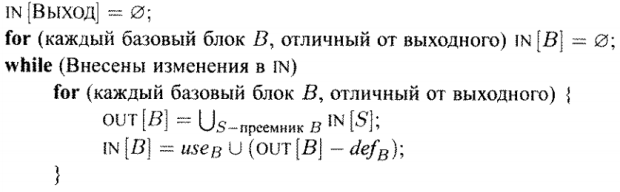

# Итерационный алгоритм для активных переменных

## Постановка задачи
Реализовать итерационный алгоритм для активных переменных

## Команда — исполнитель
ZG

## Зависимости
Зависит от:
-   Трёхадресный код
-   Граф потоков управления
-   Def-Use
-   Передаточная функция

## Теория
**Определение.** Переменная x активна в точке p если значение x из точки
p может использоваться вдоль некоторого пути, начинающегося в p. 
**Определение** 
*def_B* - множество переменных, определённых в B до любого их
использования 
*use_B* - множество переменных, значения которых могут использоваться
в B до любого их определения 

**Алгоритм** 
Вход: граф потока управления, в котором для каждого ББл вычислены
def_B и use_B 
Выход: Множества переменных, активных на входе IN[B] и на выходе
OUT[B] для всех ББл B

## Реализация
Для решения поставленной задачи был реализован класс ActiveVariablesITA, наследуемый от IterationAlgorithm.
В классе IterationAlgorithm реализован метод `Execute` (более подробно описан [здесь](44-teamZG.md)), который является общим
для всех итерационных алгоритмов. Его результат зависит от способа инициализации множеств `IN[B]` и `OUT[B]`, направления обхода
графа потоков управления, передаточной функции и оператора сбора. 
**Параметры итерационного алгоритма для активных переменных**
- Направление: обратное
- Передаточная функция: *use_B ∪ (x - def_B)*
- Оператор сбора: ∪
- Инициализация: IN[B] = ∅

## Тесты
&mdash;

## Вывод
Реализован итерационный алгоритм для активных переменных.
