# Введение

Было получено задание разработать оптимизирующий компилятор. В ходе разработки необходимо изучить разные подходы к оптимизации пользовательского кода. Первоначальными оптимизациями являются оптимизации AST дерева и трёхадресного кода. Эти оптимизации должны распределиться между всеми командами и в конечнном проекте запускаться каскадно. Необходима разработка системы выделения и хранения базовых блоков, а также графа потока управления. В процессе выполнения задачи нужно рассмотреть такие понятия как достигающие определения, активные переменные и доступные выражения, а также итерационные алгоритмы для каждого из них. Для структур потоков данных с использованием итеративного алгоритма требуются передаточные функции, а также их композиции. Для анализа потока данных используются полурешетки, с помощью которых естественным образом индуцируется отношение частичного порядка. Чтобы получить анализ графа потока управления необходимо вычислить доминаторы, построить глубинное остовное дерево, реализовать функцию по выявлению приводимого графа, а такжн классифицировать рёбра графа на три группы: наступающие, отступающие и поперечные. Для построения естественных циклов в графе потока управления требуется реализовать вычисление глубины графа. С помощью свойств естественных циклов можно реализовать измененный итерационный алгоритм.


# Cодержание
Список всех задач:
1. [Парсер языка и построение AST-дерева](#Парсер-языка-и-построение-AST-дерева)
1. [Замена выражения вида 0 * expr, expr * 0 на 0.](#Замена-выражения-вида-0-*-expr,-expr-*-0-на-0.)
1. [Cвёртка констант в AST-дереве.](#Cвёртка-констант-в-AST-дереве.)
1. [Замена выражения вида 0 * expr, expr * 0 на 0.](#Замена-выражения-вида-0-*-expr,-expr-*-0-на-0.)
1. [Замена выражения вида 1 * expr, expr * 1, expr / 1 на expr.](#Замена-выражения-вида-1-*-expr,-expr-*-1,-expr-/-1-на-expr.)
1. [Замена выражений вида 2 < 3 на true (false)](#Замена-выражений-вида-2-<-3-на-true-(false))
1. [Оптимизация по дереву вида a > a, a != a](#Оптимизация-по-дереву-вида-a->-a,-a-!=-a)
1. [Замена выражения вида x = x на null.](#Замена-выражения-вида-x-=-x-на-null.)
1. [Замена if (true) st1; else st2; на st1.](#Замена-if-(true)-st1;-else-st2;-на-st1.)
1. [Замена выражения вида if (false) expr1 else expr2 на expr2.](#Замена-выражения-вида-if-(false)-expr1-else-expr2-на-expr2.)
1. [Замена выражений вида if (false) st1; else st2; на st2](#Замена-выражений-вида-if-(false)-st1;-else-st2;-на-st2)
1. [Удаление мертвых ветвлений.](#Удаление-мертвых-ветвлений.)
1. [Замена while (false) st; на null.](#Замена-while-(false)-st;-на-null.)
1. [Замена while (false) st; на null.](#Замена-while-(false)-st;-на-null.)
1. [Структура для представления трехадресного кода и его генерация.](#Структура-для-представления-трехадресного-кода-и-его-генерация.)
1. [Разбиение трёхадресного кода на базовые блоки.](#Разбиение-трёхадресного-кода-на-базовые-блоки.)
1. [Вычисление Def-Use в пределах базового блока.](#Вычисление-Def-Use-в-пределах-базового-блока.)

1. [Протяжка констант на основе Def-Use в пределах базового блока.](#Протяжка-констант-на-основе-Def-Use-в-пределах-базового-блока.)

1. [Протяжка копий на основе Def-Use в пределах базового блока.](#Протяжка-копий-на-основе-Def-Use-в-пределах-базового-блока.)
1. [Живые и мертвые переменные внутри ББЛ.](#Живые-и-мертвые-переменные-внутри-ББЛ.)

1. [Свёртка констант. Алгебраические тождества.](#Свёртка-констант.-Алгебраические-тождества.)

1. [Оптимизация логических тождеств.](#Оптимизация-логических-тождеств.)

1. [Оптимизация общих подвыражений и протяжка копий.](#Оптимизация-общих-подвыражений-и-протяжка-копий.)

2. [Очистка от пустых операторов, устранение переходов через переходы.](#Очистка-от-пустых-операторов,-устранение-переходов-через-переходы.)

1. [Устранение недостижимого кода.](#Устранение-недостижимого-кода.)

1. [Устранение переходов к переходам.](#Устранение-переходов-к-переходам)

1. [Local Value Numbering (LVN).](#Local-Value-Numbering-(LVN).)

1. [Разбиение CFG (Control FlowGraph).](#Разбиение-CFG-(Control-FlowGraph).)

1. [Достигающие определения - genB, killB.](#Достигающие-определения-genB,-killB.)

1. [Хранение IN-OUT.](#Хранение-IN-OUT.)

1. [Передаточная функция базового блока В (Вычисление путем композиции).](#Передаточная-функция-базового-блока-В-(Вычисление-путем-композиции).)

1. [Передаточная функция базового блока В (Вычисление путем применения явных формул).](#Передаточная-функция-базового-блока-В-(Вычисление-путем-применения-явных-формул).)

1. [Вычисление множеств def и use для активных переменных.](#Вычисление-множеств-def-и-use-для-активных-переменных.)

1. [Итерационный алгоритм для активных переменных.](#Итерационный-алгоритм-для-активных-переменных.)

1. [Протяжка const на основе итеративного алгоритма для достигающих определений.](#Протяжка-const-на-основе-итеративного-алгоритма-для-достигающих-определений.)

1. [Удаление мертвого кода на основе ИТА для активных переменных.](#Удаление-мертвого-кода-на-основе-ИТА-для-активных-переменных.)

1. [Итерационный алгоритм для достигающих определений.](#Итерационный-алгоритм-для-достигающих-определений.)

1. [Итерационный алгоритм для доступных выражений.](#Итерационный-алгоритм-для-доступных-выражений.)

1. [Провести оптимизации на основе анализа доступных выражений.](#Провести-оптимизации-на-основе-анализа-доступных-выражений.)

1. [Доступные выраж.-множества e_genB, e_killB. Передаточная ф-ия ББЛ в fB = e_genB U (x - e_killB).](#Доступные-выраж.-множества-e_genB,-e_killB.-Передаточная-ф-ия-ББЛ-в-fB-=-e_genB-U-(x-e_killB).)

1. [Общий класс для передаточной функции.](#Общий-класс-для-передаточной-функции.)

1. [Обобщённый итерационный алгоритм. Распространение констант.](#Обобщённый-итерационный-алгоритм.-Распространение-констант.)

1. [Оператор сбора /\ и отображение m в задаче о распространении констант.](#Оператор-сбора-/\-и-отображение-m-в-задаче-о-распространении-констант.)

1. [Поиск решения методом MOP.](#Поиск-решения-методом-MOP.)

1. [Построение дерева доминаторов.](#Построение-дерева-доминаторов.)

1. [Итерационный алгоритм для задачи распространения констант.](#Итерационный-алгоритм-для-задачи-распространения-констант.)

1. [Передаточная функция в задаче о распространении констант.](#Передаточная-функция-в-задаче-о-распространении-констант.)

1. [Классификация ребер в CFG.](#Классификация-ребер-в-CFG.)

1. [Определение глубины cfg.](#Определение-глубины-cfg.)

1. [Определение того, является ли ребро обратимым и является ли CFG приводимым.](#Определение-того,-является-ли-ребро-обратимым-и-является-ли-CFG-приводимым.
)
1. [Определение всех естественных циклов в CFG с информацией об их вложенности.](#Определение-всех-естественных-циклов-в-CFG-с-информацией-об-их-вложенности.)

1. [Построение глубинного остовного дерева с соответствующей нумерацией вершин.](#Построение-глубинного-остовного-дерева-с-соответствующей-нумерацией-вершин.)

1. [Ускорение итерационного алгоритма для задачи о достигающих определениях, засчет перенумерации базовых блоков.](#Ускорение-итерационного-алгоритма-для-задачи-о-достигающих-определениях,-засчет-перенумерации-базовых-блоков.)
# Парсер языка и построение AST-дерева.
## Постановка задачи
Написать парсер языка на языке C# с использованием GPLex и Yacc. Реализовать построение синтаксического дерева программы.

## Команда — исполнитель
M&M

## Зависимости
&mdash;

## Теория
Для решения данной задачи необходимо реализовать две составляющие: лексер и парсер языка.  **Опр.** Лексический анализатор (лексер) — это программа или часть программы, выполняющая лексический анализ. Лексер предназначен для разбиения входного потока символов на лексемы - отдельные, осмысленные единицы программы.

Основные задачи, которые выполняет лексер:

-   Выделение идентификаторов и целых чисел
-   Выделение ключевых слов
-   Выделение символьных токенов

**Опр.**  Парсер (или синтаксический анализатор) — часть программы, преобразующей входные данные (как правило, текст) в структурированный формат. Парсер выполняет синтаксический анализ текста. Парсер принимает на вход поток лексем и формирует абстрактное синтаксическое дерево (AST).
## Реализация
Для автоматического создания парсера создаются файлы SimpleLex.lex (описание лексического анализатора) и SimpleYacc.y (описание синтаксического анализатора). Код лексического и синтаксического анализаторов создаются на C# запуском командного файла generateParserScanner.bat.

Синтаксически управляемая трансляция состоит в том, что при разборе текста программы на каждое распознанное правило грамматики выполняется некоторое действие. Данные действия придают смысл трансляции (переводу) и поэтому мы называем их семантическими. Семантические действия записываются в .y-файле после правил в фигурных скобках и представляют собой код программы на C# (целевом языке компилятора).

Как правило, при трансляции программа переводится в другую форму, более приспособленную для анализа, дальнейших преобразований и генерации кода.

Мы будем переводить текст программы в так называемое синтаксическое дерево. Если синтаксическое дерево построено, то программа синтаксически правильная, и ее можно подвергать дальнейшей обработке.

В синтаксическое дерево включаются узлы, соответствующие всем синтаксическим конструкциям языка. Атрибутами этих узлов являются их существенные характеристики. Например, для узла оператора присваивания AssignNode такими атрибутами являются IdNode - идентификатор в левой части оператора присваивания и ExprNode - выражение в правой части оператора присваивания.
#### Парсер языка
Парсер был реализован для языка со следующим синтаксисом:
```csharp
a = 777; // оператор присваивания
```
```csharp
// пример арифметических операций
a = a - b;
c = a + b;
a = a * 3;
a = 5 * b;
```
```csharp
// пример операторов сравнения
c = a < b;
c = a > b;
c = a == b;
a = 5 * b;
// логическое "нет"
c = !a;
```
```csharp
// полная форма условного оператора
if (a < b)    
	a = 555;
else
{
    b = 666;
    с = 777;
}
// сокращенная форма условного оператора 
if (b == c)    
	c = 666;
```
```csharp
// операторы циклов
// цикл while
while(a < b)
{
    ...
}
// цикл for
for(i = 0 to 10)
{    
	...
}
```

```csharp
// оператор goto
goto l 7:
// переход по метке
l 7:
```
Для создания парсера использовались Yacc и GPLex, были созданы соответствующие файлы .y и .lex.  
Пример содержимого .y файла:
```
%token <iVal> INUM
%token <dVal> RNUM
%token <sVal> ID

%type <eVal> expr ident T F S
%type <stVal> statement assign block
 empty while for if println
 idenlist label goto
%type <blVal> stlist block

%%
progr : stlist { root = $1; }
	  ;
statement: assign SEMICOLON { $$ = $1; }
		| block { $$ = $1; }
		| empty SEMICOLON  { $$ = $1; }
		| while { $$ = $1; }
		| for { $$ = $1; }
		| if { $$ = $1; }
		| label { $$ = $1; }
		| goto { $$ = $1; }
		| idenlist SEMICOLON { $$ = $1;}
		;
```
Пример содержимого .lex файла:
```
{REALNUM} {
	yylval.dVal = double.Parse(yytext);
	return (int)Tokens.RNUM;
}
{ID}  {
	int res = ScannerHelper.GetIDToken(yytext);
	if (res == (int)Tokens.ID)
		yylval.sVal = yytext;
	return res;
}
"=" { return (int)Tokens.ASSIGN; }
";" { return (int)Tokens.SEMICOLON; }
":" { return (int)Tokens.COLON; }
```
#### Построение AST-дерева

Для построения AST дерева были созданы классы для каждого типа узла:
-   Node.cs - базовый класс для всех узлов
    
-   ExprNode.cs  - базовый класс для выражений
    
-   AssignNode.cs - операция присваивания
    
-   BinOpNode.cs  - класс для бинарных операций
    
-   UnOpNode - класс для унарных операций
    
-   IntNumNode.cs - класс для целочисленных констант
    
-   IdNode.cs - класс для идентификаторов
    
-   StatementNode.cs - базовый класс для всех операторов
    
-   BlockNode.cs  - класс для блока
    
-   WhileNode.cs  - класс для цикла  _while_
    
-   ForNode.cs - класс для цикла  _for_
    
-   GotoNode.cs - класс для  _goto_
    
-   IfNode.cs - класс для оператора сравнения
    
-  LabelNode.cs - класс метки goto
    
-   EmptyNode.cs - класс для пустого узла

Пример кода, описывающего оператор цикла  _while_:
```csharp
public class WhileNode : StatementNode
{
	public ExprNode Expr { get; set; }
	public StatementNode Stat { get; set; }
	public WhileNode(ExprNode expr, StatementNode stat)
	{
		Expr = expr;
		Stat = stat;
	}
	public override void Visit(Visitor v)
	{
		v.VisitWhileNode(this);
	}
	public override string ToString()
	{
		return "while(" + Expr + ")\n" + Stat;
	}
}
```
## Тесты
&mdash;

## Вывод
Был реализован парсер языка и построено AST-дерево.

# Замена выражения вида 1 * expr, expr * 1, expr / 1 на expr.

## Постановка задачи
Заменить выражения вида `1 * expr`, `expr * 1`, `expr / 1` на `expr` с помощью визитора.

## Команда — исполнитель
TZ

## Зависимости
Зависит от:
- Базовые визиторы
- PrettyPrinter

## Теория
&mdash;

## Реализация
Для решения поставленной задачи был реализован визитор, наследуемый от ChangeVisitor.

```csharp
class SimplifyMultDivisionByOneVisitor : ChangeVisitor
    {
        public override void VisitBinOpNode(BinOpNode binop)
        {
            base.VisitBinOpNode(binop);
            if (binop.Op == "*")
            {
                ExprNode expr1 = binop.Left;
                ExprNode expr2 = binop.Right;
                if (expr1 is IntNumNode expr && expr.Num == 1)
                {
                    ReplaceExpr(expr1.Parent as ExprNode, expr2);
                }
                else if (expr2 is IntNumNode exp && exp.Num == 1)
                {
                    ReplaceExpr(expr2.Parent as ExprNode, expr1);
                }
            }
            if (binop.Op == "/")
            {
                ExprNode expr1 = binop.Left;
                ExprNode expr2 = binop.Right;
                if (expr2 is IntNumNode exp && exp.Num == 1)
                {
                    ReplaceExpr(expr2.Parent as ExprNode, expr1);
                }
            }
        }
    }
```

## Тесты
Узнать как должны выглядить тесты в докуметации.

## Вывод
Используя метод, описанный выше, мы получили визитор, заменяющий выражения вида `1 * expr`, `expr * 1`, `expr / 1` на `expr`.
# Замена выражения вида 0 * expr, expr * 0 на 0.

## Постановка задачи
Заменить выражения вида `0 * expr`, `expr * 0` на `0` с помощью визитора.

## Команда — исполнитель
Kt

## Зависимости
Зависит от:
- Базовые визиторы
- PrettyPrinter

## Теория
&mdash;

## Реализация
Для решения поставленной задачи был реализован визитор, наследуемый от ChangeVisitor.

```csharp
class ZeroMulOptVisitor : ChangeVisitor
    {

        public override void VisitBinOpNode(BinOpNode binop)
        {
            var isZeroLeft = binop.Left is IntNumNode && (binop.Left as IntNumNode).Num == 0;
            var isZeroRight = binop.Right is IntNumNode && (binop.Right as IntNumNode).Num == 0;

            if (string.Equals(binop.Op, "*") && (isZeroRight || isZeroLeft))
                ReplaceExpr(binop, new IntNumNode(0));
            else base.VisitBinOpNode(binop);
        }
    }
```

## Тесты
Узнать как должны выглядить тесты в докуметации.

## Вывод
Используя метод, описанный выше, мы получили визитор, заменяющий выражения вида `0 * expr`, `expr * 0` на `0`.
# Cвёртка констант в AST-дереве.

## Постановка задачи
Заменить алгебраические выражения вида "2 * 3" их рассчитанным ответом "6" с помощью визитора.
## Команда — исполнитель
Null

## Зависимости
Зависит от:
- Базовые визиторы
- PrettyPrinter

## Теория
Данная оптимизация заключается в свёртке констант в AST-дереве.

Пример:
```
x = 2 * 3; ==> x = 6;
```
## Реализация
Для решения поставленной задачи был реализован визитор "ConstFoldingVisitor", наследуемый от ChangeVisitor.

```csharp
public class ConstFoldingVisitor : ChangeVisitor
    {
        public override void VisitBinOpNode(BinOpNode binop)
        {
            base.VisitBinOpNode(binop);
            if (binop.Left is IntNumNode left && binop.Right is IntNumNode right)
            {
                var num = 0;

                switch (binop.Op)
                {
                    case "+":
                        num = left.Num + right.Num;
                        break;
                    case "-":
                        num = left.Num - right.Num;
                        break;
                    case "*":
                        num = left.Num * right.Num;
                        break;
                    case "/":
                        num = left.Num / right.Num;
                        break;
                }

                var newInt = new IntNumNode(num);
                ReplaceExpr(binop, newInt);
            }
        }
	}
```

## Тесты
#### INPUT: 
```
x = 50 * 10;
```
#### OUTPUT:
```
x = 500;
```

## Вывод
Используя метод, описанный выше, мы получили визитор, производящий свертку констант.
# Замена выражения вида 0 + expr (expr + 0) на expr.

## Постановка задачи
Заменить выражения вида `0 + expr` (`expr + 0`) на `expr` с помощью визитора.

## Команда — исполнитель
AW

## Зависимости
Зависит от:
- Базовые визиторы
- PrettyPrinter

## Теория
Данная оптимизация заключается в замене выражений вида `0 + expr` или `expr + 0` на `expr` в AST-дереве.

Пример:
```
x = 2 * a + 0;   ==>   x = 2 * a;
```

## Реализация
Для решения поставленной задачи был реализован визитор, наследуемый от ChangeVisitor.

```csharp
class PlusZeroExprVisitor : ChangeVisitor
{
    public override void VisitBinOpNode(BinOpNode binop)
    {
        base.VisitBinOpNode(binop);
        if (binop.Op == "+")
        {
            ExprNode expr1 = binop.Left;
            ExprNode expr2 = binop.Right;
            if (expr1 is IntNumNode expr && expr.Num == 0)
            {
                ReplaceExpr(expr1.Parent as ExprNode, expr2);
            }
            else if (expr2 is IntNumNode exp && exp.Num == 0)
            {
                ReplaceExpr(expr2.Parent as ExprNode, expr1);
            }
        }
    }
}
```

## Тесты
#### INPUT: 
```csharp
x = (((42 * a) + 0) - (0 + (13 * y)));
```
#### OUTPUT:
```csharp
x = ((42 * a) - (13 * y));
```

## Вывод
Используя метод, описанный выше, мы получили визитор, заменяющий выражения вида `0 + expr` (`expr + 0`) на `expr`.
# Замена выражения вида a - a на 0.

## Постановка задачи
Заменить выражения вида `a - a` на `0` с помощью визитора.

## Команда — исполнитель
M&M

## Зависимости
Зависит от:

-   Базовые визиторы
-   PrettyPrinter

## Теория
&mdash;
## Реализация

Для решения поставленной задачи был реализован визитор, наследуемый от ChangeVisitor.

```csharp
class SameMinusOptVisitor : ChangeVisitor
{
	public override void VisitBinOpNode(BinOpNode binop)
	{
		base.VisitBinOpNode(binop);
		if (binop.Op == "-")
		{
			ExprNode expr1 = binop.Left;
			ExprNode expr2 = binop.Right;
			if (expr1 is IdNode && expr2 is IdNode)
			{
				if ((expr1 as IdNode).Name == (expr2 as IdNode).Name)
				{
					ReplaceExpr(expr1.Parent as ExprNode, new IntNumNode(0));
				}
			}
		}
	}
}
```

## Тесты
#### INPUT: 
```csharp
x = (a - a);
```
#### OUTPUT:
```csharp
x = 0;
```

## Вывод
Используя метод, описанный выше, мы получили визитор, заменяющий выражения вида `a - a` на `0`.
# Замена выражений вида 2 < 3 на true (false).

## Постановка задачи
Заменить выражения вида `2 < 3` на `true (false)` с помощью визитора.

## Команда — исполнитель
ZG

## Зависимости
Зависит от:

-   Базовые визиторы
-   PrettyPrinter

## Теория
&mdash;

## Реализация
Для решения поставленной задачи был реализован визитор, наследуемый от ChangeVisitor.

```csharp
class CheckTruthVisitor: ChangeVisitor
{
    public override void VisitBinOpNode(BinOpNode binop)
    {
        base.VisitBinOpNode(binop);
        if (binop.Op == "<")
        {
            ExprNode expr1 = binop.Left;
            ExprNode expr2 = binop.Right;

            if (expr1 is IntNumNode ex && expr2 is IntNumNode ex2)
            {
                if (ex.Num < ex2.Num)
                {
                    ReplaceExpr(expr1.Parent as ExprNode, new BoolNode(true));
                }
            }
        }
    }
}
```

## Тесты
INPUT:
```
a = 2 < 3;
if (5 < 10) {
  a = 0 < 2;
}
```
OUTPUT:
```
a = true;
if (true)
{
  a = true;
}
```

## Вывод
Используя метод, описанный выше, реализован визитор, заменяющий выражения вида `2 < 3` на `true (false)`.
# Оптимизация по дереву вида a > a, a != a.

## Постановка задачи
Задача состояла в реализации оптимизаций AST-дерева вида `a > a` и `a != a`

## Команда — исполнитель
Enterprise

## Зависимости
Зависит от:

-   Базовые визиторы
-   PrettyPrinter

## Теория
При возникновении логического выражения вида `a > a` или `a != a` его необходимо заменить на `a`.

## Реализация
Для решения поставленной задачи был реализован визитор, наследуемый от ChangeVisitor.

```csharp
class CompareToItselfFalseOptVisitor : ChangeVisitor
    {
        public override void VisitBinOpNode(BinOpNode binop)
        {
            if (binop.Left is IdNode left && binop.Right is IdNode right)
            {
                var isNamesEqual = string.Equals(left.Name, right.Name);
                if (string.Equals(binop.Op, ">") || string.Equals(binop.Op, "!=") && isNamesEqual)
                    ReplaceExpr(binop, new BoolNode(false));
                else base.VisitBinOpNode(binop);
            }
        }
    }
```

## Тесты
#### INPUT: 
```
c = 9;
a = c > c;
```
#### OUTPUT:
```
c = 0;
a = false;
```

## Вывод
В результате работы был написан визитор, который посещает все узлы AST-дерева и применяет оптимизации вида `a > a` и `a != a`.
# Замена выражения вида x = x на null.

## Постановка задачи
Заменить выражения вида `x = x` на `null` с помощью визитора.

## Команда — исполнитель
TZ

## Зависимости
Зависит от:
- Базовые визиторы
- PrettyPrinter

## Теория
&mdash;

## Реализация
Для решения поставленной задачи был реализован визитор, наследуемый от ChangeVisitor.

```csharp
class RemoveSelfAssignment : ChangeVisitor
    {
        public override void VisitAssignNode(AssignNode a)
        {
            IdNode id = a.Id;
            ExprNode expr = a.Expr; 

            if (expr is IdNode idExpr)
            {
  
                if (id.Name == idExpr.Name)
                {
                    ReplaceStatement(a, new EmptyNode());
                }
            }
        }
    }
```

## Тесты
Узнать как должны выглядить тесты в докуметации.

## Вывод
Используя метод, описанный выше, мы получили визитор, заменяющий выражения вида `x = x` на `null`.
# Замена if (true) st1; else st2; на st1.

## Постановка задачи
Заменить выражения вида `if (true) st1; else st2;` на `st1` с помощью визитора.

## Команда — исполнитель
AW

## Зависимости
Зависит от:
- Базовые визиторы
- PrettyPrinter

## Теория
Данная оптимизация заключается в замене выражений вида `if (true) st1; else st2;` на `st1` в AST-дереве.

Пример:
```
if (true) {
    x = 3 * b;
} else {                 ===>       x = 3 * b;
    x = 2 * a + 10;
}
```

## Реализация
Для решения поставленной задачи был реализован визитор, наследуемый от ChangeVisitor.

```csharp
class IfNodeWithBoolExprVisitor : ChangeVisitor
{
    public override void VisitIfNode(IfNode inode)
    {
        if (inode.Expr is BoolNode bln && bln.Value == true)
        {
            inode.Stat1.Visit(this);
            ReplaceStatement(inode, inode.Stat1);
        }
        else
        {
            base.VisitIfNode(inode);
        }
    }
}
```

Также был реализован метод ReplaceStatement для визитора ChangeVisitor, который позволяет заменять StatementNode:

```csharp
public void ReplaceStatement(StatementNode from, StatementNode to)
{
    var p = from.Parent;
    if (p is AssignNode || p is ExprNode)
    {
        throw new Exception("Родительский узел не содержит операторов");
    }
    to.Parent = p;
    if (p is BlockNode bln)
    {
        for (var i = 0; i < bln.StList.Count; ++i)
        {
            if (bln.StList[i] == from)
            {
                bln.StList[i] = to;
                break;
            }
        }
    }
    else if (p is IfNode ifn)
    {
        if (ifn.Stat1 == from)
        {
            ifn.Stat1 = to;
        }
        else if (ifn.Stat2 == from)
        {
            ifn.Stat2 = to;
        }
    }
    else
    {
        throw new Exception("ReplaceStatement не определен для данного типа узла");
    }
}
```

## Тесты
#### INPUT: 
```csharp
if (true)
{
  s = 11;
}
else
{
  s = 42;
}
```
#### OUTPUT:
```csharp
{
  s = 11;
}
```
## Вывод
Используя метод, описанный выше, мы получили визитор, заменяющий выражения вида `if (true) st1; else st2;` на `st1`.
# Замена выражений вида if (false) st1; else st2; на st2.

## Постановка задачи
Заменить выражения вида `if (false) st1; else st2;` на `st2` с помощью визитора.

## Команда — исполнитель
ZG

## Зависимости
Зависит от:

-   Базовые визиторы
-   PrettyPrinter

## Теория
&mdash;

## Реализация
Для решения поставленной задачи был реализован визитор, наследуемый от ChangeVisitor.

```csharp
class AlwaysElseVisitor: ChangeVisitor
{
    public override void VisitIfNode(IfNode inode)
    {
        base.VisitIfNode(inode);
        if (inode.Expr is BoolNode expr && expr.Value == false)
        {
             ReplaceStatement(inode, inode.Stat2 ?? new EmptyNode());
        }
        else
        {
            base.VisitIfNode(inode);
        }
    }
}
```

## Тесты
INPUT:
```
if (false) {
  a = 5;
}
else {
  b = 7;
}
```
OUTPUT:
```
{
  b = 7;
}
```

## Вывод
Используя метод, описанный выше, реализован визитор, заменяющий выражения вида `if (false) st1; else st2;` на `st2`.
# Замена выражения вида if (false) expr1 else expr2 на expr2.

## Постановка задачи
Заменить выражения вида `if (false) expr1 else expr2` на `expr2` с помощью визитора.

## Команда — исполнитель
Kt

## Зависимости
Зависит от:
- Базовые визиторы
- PrettyPrinter

## Теория
&mdash;

## Реализация
Для решения поставленной задачи был реализован визитор, наследуемый от ChangeVisitor.

```csharp
class AlwaysElseVisitor: ChangeVisitor
    {
        public override void VisitIfNode(IfNode inode)
        {
            base.VisitIfNode(inode);
            if (inode.Expr is BoolNode expr && expr.Value == false)
            {
                 ReplaceStatement(inode, inode.Stat2 ?? new EmptyNode());
            }
            else
            {
                base.VisitIfNode(inode);
            }
        }

    }
```

## Тесты
&mdash;

## Вывод
Используя метод, описанный выше, мы получили визитор, заменяющий выражения вида `if (false) expr1 else expr2` на `expr2`.
# Замена while (false) st; на null.

## Постановка задачи
Заменить выражения вида `while (false) st;` на `null` с помощью визитора.

## Команда — исполнитель
M&M

## Зависимости
Зависит от:

-   Базовые визиторы
-   PrettyPrinter

## Теория

Данная оптимизация заключается в том, чтобы заменять любой оператор *while* вида
``` 
while (false)
	st;
```
на выражение *null*, так как при любом *expression* в условном операторе будет получен *null*.

## Реализация

Для решения поставленной задачи был реализован визитор, наследуемый от ChangeVisitor.

```csharp
class WhileFalseOptVisitor: ChangeVisitor
{
	public override void VisitWhileNode(WhileNode c)
	{
		if (c.Expr is BoolNode bn && bn.Value == false)
		{
			ReplaceStatement(c, new EmptyNode());
		}
	}
}
```
Также был реализован метод ReplaceStatement для визитора ChangeVisitor, который позволяет заменять StatementNode:

```csharp
public void ReplaceStatement(StatementNode from, StatementNode to)
{
	var p = from.Parent;
	if (p is AssignNode || p is ExprNode)
	{
		throw new Exception("Родительский узел не содержит операторов");
	}
	to.Parent = p;
	if (p is BlockNode bln)
	{
		for (var i = 0; i < bln.StList.Count; ++i)
		{
			if (bln.StList[i] == from)
			{
				bln.StList[i] = to;
				break;
			}
		}
	}
	else if (p is IfNode ifn)
	{
		if (ifn.Stat1 == from)
		{
			ifn.Stat1 = to;
		}
		else if (ifn.Stat2 == from)
		{
			ifn.Stat2 = to;
		}
	}
	else
	{
		throw new Exception("ReplaceStatement не определен для данного типа узла");
	}
}
```
## Тесты
#### INPUT: 
```csharp
while(false)
	x = a;
x = b;
```
#### OUTPUT:
```csharp
x = b;
```

## Вывод
Используя метод, описанный выше, мы получили визитор, заменяющий выражения вида `while (false) st;` на `null`.
# Удаление мертвых ветвлений.

## Постановка задачи
Заменить выражения вида `if (ex) null; else null;` на `null` с помощью визитора.

## Команда — исполнитель
Null

## Зависимости
Зависит от:
- Базовые визиторы
- PrettyPrinter

## Теория
Данная оптимизация заключается в том, чтобы заменять любой условный оператор вида
``` 
if(expression)
	null;
else
	null;
```
на выражение *null* так как при любом *expression* в условном операторе будет получен *null*.

## Реализация
Для решения поставленной задачи был реализован визитор _DelOfDeadConditionsVisitor_, наследуемый от ChangeVisitor.

```csharp
  public class DelOfDeadConditionsVisitor : ChangeVisitor
    {
        public override void VisitBlockNode(BlockNode bl)
        {
            for (int i = 0; i < bl.StList.Count; i++)
                if (bl.StList[i] is IfNode ifn)
                {
                    var stlist1 = ifn.Stat1 as BlockNode;
                    var stlist2 = ifn.Stat2 as BlockNode;
                    bool null1, null2;
                    null1 = null2 = false;
                    if (stlist1.StList.Count == 1 & stlist1.StList[0] is EmptyNode)
                        null1 = true;
                    if (stlist2.StList.Count == 1 & stlist2.StList[0] is EmptyNode)
                        null2 = true;

                    if (null1 && null2)
                        bl.StList[i] = new EmptyNode();
                    else
                        base.VisitIfNode(ifn);
                }
        }
    }
```

## Тесты

#### INPUT:
```
if(a == b)
	{;}
else
	{;}
```

#### OUTPUT:
```
null
```

## Вывод
Используя метод, описанный выше, мы получили визитор, производящий удаление мертвых ветвлений.
# Структура для представления трехадресного кода и его генерация.

## Постановка задачи

Реализация классов для представления и хранения строк трехадрессного кода, реализация визитора  для генерации строк трехадресного кода по AST.

## Команда — исполнитель

AW

## Зависимости

Зависит от:

- Парсер языка и генерация AST (M&M)  

Препятствует:

- Трехадресный код &mdash; это "язык оптимизаций", на базе него построена вся дальнейшая работа.

## Теория

Трехадресный код &mdash; это представление программы как последовательности операторов вида: `a = b op c`, где `a`, `b`, `c` &mdash; это имена переменных или константы, а `op` &mdash; это бинарная арифметическая или логическая операция.

Основным принципом трехадресного кода является то, что каждая строка не может содержать в себе более трех адресов.

Составные выражения при генерации трехадресного кода должны быть разбиты на подвыражения, каждое из которых должно быть присвоено соответствующей временной переменной, название у которых было принято единым: `tn`, где `n` &mdash; это уникальное для текущей временной переменной число-номер, обозначающий ее порядок при проведении генерации (нумерация временных переменных сквозная в рамках одного времени работы компилятора).

Помимо операторов присваивания с двумя операндами и бинарной операцией между ними, в трехадресном коде могут содержаться следующие конструкции:

- Метка строки `Ln:` для совершения перехода (каждая строка трехадресного кода может иметь метку);

- оператор безусловного перехода `goto Ln`;

- оператор условного перехода `if cond goto Ln`, где `cond` &mdash; это условие совершения прыжка к строке с меткой `Ln`;

- присваивания с унарными операциями `t1 = -t2`.

- вызовы функций в качестве первого и второго операндов оператора присваивания `a = func()`

## Реализация

Представление конструкций трехадресного кода (далее &mdash; ТАК) решено было выполнить в качестве объектов-наследников абстрактного класса:

```csharp
namespace SimpleLang.TACode.TacNodes
{
    /// <summary>
    /// Абстрактный класс для строки трехадресного кода
    /// </summary>
    public abstract class TacNode
    {
        /// <summary>
        /// Метка текущей строки трехадресного кода
        /// </summary>
        public string Label { get; set; } = null;
        /// <summary>
        /// Флаг-индикатор того, что данная метка была сгенерирована автоматически при обработке
        /// конструкций if/while/for
        /// </summary>
        public bool IsUtility { get; set; } = false;

        public override string ToString() => Label != null ? Label + ": " : "";
    }
}
```
Данный класс содержит лишь метку, как единственную общую характеристику каждой конструкции ТАК.
В качестве наследников `TacNode` были реализованы следующие классы:

- `TacAssignmentNode` &mdash; оператор присваивания

```csharp
namespace SimpleLang.TACode.TacNodes
{
    /// <inheritdoc />
    /// <summary>
    /// Представление оператора присваивания
    /// </summary>
    public class TacAssignmentNode : TacNode
    {
        /// <summary>
        /// Идентификатор адреса для записи вычисленного значения правой части
        /// </summary>
        public string LeftPartIdentifier { get; set; }
        /// <summary>
        /// первый операнд правой части
        /// </summary>
        public string FirstOperand { get; set; }
        /// <summary>
        /// Второй операнд правой части
        /// </summary>
        public string SecondOperand { get; set; } = null;
        /// <summary>
        /// Выполняемая операция
        /// </summary>
        public string Operation { get; set; } = null;

        public override string ToString()
        {
            var rightPart = (Operation == null) && (SecondOperand == null)
                ? $"{FirstOperand}"
                : $"{FirstOperand} {Operation} {SecondOperand}";
            return $"{base.ToString()}{LeftPartIdentifier} = {FirstOperand} {Operation} {SecondOperand}";
        }
    }
}
```

- `TacGotoNode` &mdash; оператор безусловного перехода

```csharp
namespace SimpleLang.TACode.TacNodes
{
    /// <inheritdoc />
    /// <summary>
    /// Представление оператора безусловного перехода goto
    /// </summary>
    public class TacGotoNode : TacNode
    {
        /// <summary>
        /// Метка для строки, на которую ведется переход
        /// </summary>
        public string TargetLabel { get; set; }
        
        public override string ToString() => $"{base.ToString()}goto {TargetLabel}";
    }
}
```

- `TacIfGotoNode` &mdash; оператор перехода по условию

```csharp
namespace SimpleLang.TACode.TacNodes
{
    /// <inheritdoc />
    /// <summary>
    /// Представление условного перехода if-goto
    /// </summary>
    public class TacIfGotoNode : TacGotoNode
    {
        /// <summary>
        /// Условие для перехода на целевую метку
        /// </summary>
        public string Condition { get; set; }

        public override string ToString() => (Label != null ? Label + ": " : "") + $"if {Condition} goto {TargetLabel}";
    }
}
```

- `TacEmptyNode` &mdash; пустой оператор, наследник `TacNode` в виде неабстрактного класса для возможности инстанцирования

В качестве контейнера для трехадресного кода используется класс `ThreeAddressCode`.

Он написан на основе связного списка `LinkedList` (get-only поле
`TACodeLines`) с элементами типа `<TacNode>` и реализует интерфейс
`IEnumerable`

Он предоставляет следующий функционал:

1. Доступ к элементам на чтение и модификацию;
2. модификация контейнера;
   1. добавление строки кода (нод) в конец списка `PushNode`;
   2. добавление нескольких строк кода (нод) в конец списка
      `PushNodes(IEnumerable)`;
   3. удаление ноды из списка `RemoveNode`;
   4. удаление ноды из списка по метке `RemoveNodeByLabel`;
   5. удаление нескольких нод из списка `RemoveNodes(IEnumerable)`;
3. набор методов для удобства добавления тривиальных нод;
4. поля First/Last для удобства получения соответствующих
   LinkedListNode<>.

```csharp
/// <summary>
/// Добавить несколько строк в конец контейнера
/// </summary>
/// <param name="nodes">Перечислимое строк, которые требуется добавить</param>
public void PushNodes(IEnumerable<TacNode> nodes)
{
    foreach (var tacNode in nodes)
    {
        TACodeLines.AddLast(tacNode);
    }
}

/// <summary>
/// Удаление строки по значению
/// <exception>InvalidOperationException</exception>
/// <exception>ArgumentNullException</exception>
/// </summary>
/// <param name="node">Строка, которую требуется удалить</param>
public void RemoveNode(TacNode node)
{
    TACodeLines.Remove(node);
}
```


Для генерации имен временных переменных и меток и обеспечения сквозной нумерации используется класс
`TmpNameManager`. 

Он реализует паттерн синглтон, доступ к методам происходит через
статическое поле `Instance`.

В нем заложен счетчик меток и переменных, для генерации нового имени
следует пользоваться методами.

- TmpNameManager.Instance.GenerateTmpVariableName()
- TmpNameManager.Instance.GenerateTmpLabel()

```csharp
namespace SimpleLang.TACode
{
    public class TmpNameManager
    {
        public static readonly TmpNameManager Instance = new TmpNameManager();

        /// <summary>
        /// Счетчики меток и переменных
        /// </summary>
        private int _currentVariableCounter = 0;
        private int _currentLabelCounter = 0;
        
        /// <summary>
        /// Генерация новой переменной с уникальным именем
        /// </summary>
        /// <returns>Уникальное имя временной переменной</returns>
        public string GenerateTmpVariableName() => $"t{++_currentVariableCounter}";
        
        /// <summary>
        /// Генерация новой метки
        /// </summary>
        /// <returns>Уничкальная метка</returns>
        public string GenerateLabel() => $"L{++_currentLabelCounter}";

        /// <summary>
        /// Сбросить счетчики
        /// </summary>
        public void Drop() { _currentLabelCounter = 0; _currentVariableCounter = 0; }
    }
}
```

Для генерации трехадресного кода используется визитор
`ThreeAddressCodeVisitor`. 

В нем переопределены соответствующие методы для обхода AST и генерации
TAC для 

- Операторов присваивания (с обработкой тривиальных кейсов и логических
  операций)
- Циклов for и while
- Уловного опретора if-else
- Оператора безусловного перехода goto;

А так же метод постообработки полученной программы для удаления лишних пустых операторов с метками, автоматическая генерация которых является недостатком рекурсивного подхода.
```csharp
public void Postprocess()
{
    var nodesToRemove = new List<TacNode>();
    // Обход всех строк сверху вниз
    var currentNode = TACodeContainer.First;
    while (currentNode != null)
    {
        var next = currentNode.Next;

        if (next == null)
        {
            currentNode = next;
            continue;
        }
        if (currentNode.Value is TacEmptyNode && !(next.Value is TacEmptyNode))
        {
            // Если встретили пустой оператор
            if (currentNode.Value.Label != null)
            {
                // Если у него есть метка -- "сливаем" его со следующим за ним оператором  
                next.Value.Label = currentNode.Value.Label;
                nodesToRemove.Add(currentNode.Value);
            }
        }
        currentNode = next;
    }
    // Удаляем все встреченные пустые операторы, так как их метки теперь указывают на строки кода 
    TACodeContainer.RemoveNodes(nodesToRemove);
}
```
Пример рекурсивной функции, генерирующей строки трехадресного кода по выражению.
```csharp
 /// <summary>
/// Генерация строк трехадресного кода по выражению
/// </summary>
/// <param name="expression">Целевое выражение, по которому будет проводится генерация</param>
/// <returns>Последний идентификатор, возвращенный процессом генерации</returns>
private string GenerateThreeAddressLine(ExprNode expression)
{
    string label = null;
    switch (expression)
    {
        // Тривиальные случаи
        case IdNode idNode:
        {
            return TACodeContainer.CreateAndPushIdNode(idNode, label);
        }
        case IntNumNode intNumNode:
        {
            return TACodeContainer.CreateAndPushIntNumNode(intNumNode, label);
        }
        case BoolNode boolNode:
        {
            return TACodeContainer.CreateAndPushBoolNode(boolNode, label);
        }
        // Унарный оператор
        case UnOpNode unOpNode:
        {
            var unaryExp = ManageTrivialCases(unOpNode.Unary);
            
            var tmpName = TmpNameManager.Instance.GenerateTmpVariableName();
            TACodeContainer.PushNode(new TacAssignmentNode()
            {
                Label = label,
                LeftPartIdentifier = tmpName,
                FirstOperand = null,
                Operation = unOpNode.Op,
                SecondOperand = unaryExp
            });
            return tmpName;
        }
        // Обработка сложного случая с бинарной операцией
        case BinOpNode binOpNode:
        {   
            var leftPart = ManageTrivialCases(binOpNode.Left);
            var rightPart = ManageTrivialCases(binOpNode.Right);
            
            // Создание и добавление в контейнер полученной бинарной операции между
            // двумя сгенерированными выше переменными
            var tmpName = TmpNameManager.Instance.GenerateTmpVariableName();
            TACodeContainer.PushNode(new TacAssignmentNode()
            {
                Label = label,
                LeftPartIdentifier = tmpName,
                FirstOperand = leftPart,
                Operation = binOpNode.Op,
                SecondOperand = rightPart
            });
            return tmpName;
        }
        // Обработка логического отрицания
        case LogicNotNode logicNotNode:
        {
            var unaryExp = ManageTrivialCases(logicNotNode.LogExpr);
            
            var tmpName = TmpNameManager.Instance.GenerateTmpVariableName();
            TACodeContainer.PushNode(new TacAssignmentNode()
            {
                Label = label,
                LeftPartIdentifier = tmpName,
                FirstOperand = null,
                Operation = "!",
                SecondOperand = unaryExp
            });
            return tmpName;
        }
    }

    return default(string);
}

```

## Тесты
### Input
```csharp
x = 42;
a = (x - 180) / 55 + x * 2;

if(x > 50){
    a = func2();
} else{
    a = 305;
}

b = false;
if(!b){
    b = b && (x == 0);
}

for(i = 0 to 100){
    x = i;
}    

goto l 120:

while(x < 50){
    x = x - 1;
    a = a + func();
}

l 120: x = 5;

```
### Output
```
x = 42
t1 = x - 180
t2 = t1 / 55
t3 = x * 2
t4 = t2 + t3
a = t4
t5 = x > 50
if t5 goto L1
a = 305
goto L2
L1: a = func2()
L2: b = False
t6 =  ! b
if t6 goto L3
goto L4
L3: t7 = x == 0
t8 = b && t7
b = t8
L4: i = 0
L5: x = i
i = i + 1
t9 = i < 100
if t9 goto L5
goto l120
L6: t10 = x < 50
if t10 goto L8
goto L7
L8: t11 = x - 1
x = t11
t12 = a + func()
a = t12
goto L6
L7:
l120: x = 5
```

## Вывод

Были реализованы структуры для предсавления и хранения программы в виде строк трехадресного кода. 

Был написан класс-визитор для обхода AST и генерации структур трехадресного кода.
# Разбиение трёхадресного кода на базовые блоки.

## Постановка задачи
Задача состояла в реализации поиска команд-лидеров, после чего реализации разбиения трёхадресного кода на базовые блоки.

## Команда — исполнитель
Enterprise

## Зависимости
Данная задача не зависит от других задач. 
От задачи зависит:
* задача построения графа потока управления

## Теория
Базовый блок – это максимальная последовательность команд трехадресного кода, удовлетворяющая следующим условиям:
* поток управления может входить в базовый блок только через первую команду
* управление покидает ББл без останова или ветвления, за
исключением, возможно, последней команды.

Для реализации алгоритма поиска базовых блоков необходимо сначала найти команды-лидеры. Команда называется лидером, если:
* эта команда первая
* на эту команду есть переход
* эта команда непосредственно следует за переходом.

Базовый блок каждого лидера определяется как содержащий самого лидера и все команды до (но не включая) следующего лидера или до конца программы.

## Реализация
В процессе реализации был создан класс, реализующий интерфейс _IEnumerable_. В данном классе присутствует метод, который ищет команды-лидеры. В нем происходит обход всего трехадресного кода, в ходе которого производятся несколько проверок:
```csharp
private HashSet<TacNode> FindLeaders(ThreeAddressCode RawTACode)
        {
            var previousGoto = false;
            var firstTAC = RawTACode.TACodeLines.First.Value;
            var leaderLabels = new HashSet<TacNode>{ firstTAC };

            foreach(var currentElement in RawTACode)
            {
                if (previousGoto)
                    leaderLabels.Add(currentElement);

                if (currentElement is TacGotoNode gotoNode)
                    leaderLabels.Add(RawTACode[gotoNode.TargetLabel]);

                previousGoto = currentElement is TacGotoNode;
            }
            return leaderLabels;
        }
```
Также данный класс содержит второй метод, непосредственно разбивающий трехадресный код на базовые блоки.
## Тесты
Трехадресный код исходной программы:
```
c=9
t2=c==c
a=t2
```
Полученные базовые блоки:
```
{
    c=9
    t2=c==c
    a=t2
}
```

Трехадресный код исходной программы:
```
a=123
t1=a>444
if t1 goto L1
goto L2
L1: g=34
L2:
```
Полученные базовые блоки:
```
{
    a=123
    t1=a>444
    if t1 goto L1
}
{goto L2}
{L1: g=34}
{L2: }
```

Трехадресный код исходной программы:
```
goto l7
g=34
l7:
```
Полученные базовые блоки:
```
{goto l7}
{g=34}
{l7: }
```

## Вывод
В результате работы был написан класс, который организует разбиение трехадресного кода на базовые блоки. Его работоспособность была успешно протестирована.
# Вычисление Def-Use в пределах базового блока.

## Постановка задачи
Для базового блока реализовать вычисление множеств Def-Use.

## Команда — исполнитель
AW

## Зависимости
Зависит от:
- Трехадресный код (AW)

## Теория
Переменные в базовом блоке разделяются на два типа: определения (Def) и использования (Use).

***Def*** &mdash; это определение переменной, т.е. место в коде программы, когда переменной присваивается какое-либо значение.

***Use*** &mdash; это использование переменной, т.е. место в коде программы, когда переменная участвует в выражении.

Каждый Use хранит ссылку на Def переменной или null, если переменная не определяется в данном базовом блоке. Каждый Def хранит список Use данной переменной в пределах базового блока.

```csharp
x = a;			// x определяется (Def); а использвуется (Use)
...
y = x + z;		// y определяется (Def); x, z используются (Use)
...
if (b) {		// b использвуется (Use)
...
}
```

## Реализация
Для реализации данной задачи было решено использовать Def и Use следующего вида:
```csharp
using LinkedListTacNode = System.Collections.Generic.LinkedListNode<SimpleLang.TACode.TacNodes.TacNode>;
using VarNodePair = System.Tuple<string, System.Collections.Generic.LinkedListNode<SimpleLang.TACode.TacNodes.TacNode>>;

/// <summary>
/// Определения переменных в базовом блоке
/// Ключ: пара имя переменной и нода, где переменная определена
/// Значение: список нодов, где присутствуют использования данного определения переменной 
/// </summary>
public readonly Dictionary<VarNodePair, List<LinkedListTacNode>> Definitions =
    new Dictionary<VarNodePair, List<LinkedListTacNode>>();

/// <summary>
/// Использования переменных в базовом блоке
/// Ключ: пара имя переменной и нода, где переменная используется
/// Значение: нода, где присутствует определение данной используемой переменной
/// </summary>
public readonly Dictionary<VarNodePair, LinkedListTacNode> Usages =
    new Dictionary<VarNodePair, LinkedListTacNode>();
```

Метод для поиска и заполнения Def и Use переменных:

```csharp
public void DetectAndFillDefUse(ThreeAddressCode threeAddressCode)
{
    // Получение ссылки на последний node трехадресного кода
    var lastNode = threeAddressCode.Last;

    // Временный словарь для хранения использований переменной, 
    //пока не будет найдено определение переменной
    // Ключ - имя переменной
    // Значение - список, состоящий из ссылок на node трехадресного кода, 
    //где используется переменная
    var tmpUsagesNodes = new Dictionary<string, List<LinkedListTacNode>>();

    // Обход трехадресного кода снизу - вверх
    while (lastNode != null)
    {
        switch (lastNode.Value)
        {
            case TacAssignmentNode assignmentNode:
            {
                // Добавление использования переменной (первого операнда в выражении) во временный словарь tmpUsagesNodes
                FillTmpUsagesForNode(assignmentNode.FirstOperand, lastNode, tmpUsagesNodes);

                if (assignmentNode.SecondOperand != null)
                {
                    // Добавление использования переменной (второго операнда в выражении, если он есть) во временный словарь tmpUsagesNodes
                    FillTmpUsagesForNode(assignmentNode.SecondOperand, lastNode, tmpUsagesNodes);
                }

                // Создание новой записи в словарь Definitions с текущим идентификатором переменной
                var keyNode = new VarNodePair(assignmentNode.LeftPartIdentifier, lastNode);
                Definitions[keyNode] = new List<LinkedListTacNode>();

                // Если встретили использование переменной, ранее определенной в tmpUsagesNodes  
                if (tmpUsagesNodes.ContainsKey(keyNode.Item1))
                {
                    // Заполнить список Definitions текущей переменной из tmpUsagesNodes
                    Definitions[keyNode] = tmpUsagesNodes[keyNode.Item1];

                    // Заполнить Usages нодами из tmpUsagesNodes
                    foreach (var tmp in tmpUsagesNodes[keyNode.Item1])
                    {
                        Usages[new VarNodePair(assignmentNode.LeftPartIdentifier, tmp)] = lastNode;
                    }

                    // Удаляем из временного словаря запись о просмотренной переменной 
                    tmpUsagesNodes.Remove(keyNode.Item1);
                }
                break;
            }
            case TacIfGotoNode ifGotoNode:
            {
                // В случае goto мы встречаем только использования переменных, поэтому просто добавляем их в tmpUsagesNodes
                FillTmpUsagesForNode(ifGotoNode.Condition, lastNode, tmpUsagesNodes);
                break;
            }
        }
        lastNode = lastNode.Previous;
    }

    // Если для каких-то переменных есть использования, но нет переменных, заполняем Usages, Definitions для данной переменной будет пустым
    FillUsagesWithoutDefinitions(tmpUsagesNodes);
}        
```

---
Вспомогательные методы, которые были использовании при поиске и заполнении определений и использований:

```csharp
/// <summary>
/// Добавление в tmpUses переменной operand ноды, где есть использование данной переменной
/// </summary>
/// <param name="operand"> Переменная, рассматриваемая в данный момент </param>
/// <param name="node"> Нода трехадресного кода, где используется данная переменная </param>
/// <param name="tmpUses"> Временный словарь, где зранится информация об использовании переменных </param>
private void FillTmpUsagesForNode(string operand, LinkedListTacNode node,
    IDictionary<string, List<LinkedListTacNode>> tmpUses)
{
    if (!Utility.Utility.IsVariable(operand)) return;
    if (tmpUses.ContainsKey(operand))
    {
        tmpUses[operand].Add(node);
    }
    else
    {
        tmpUses[operand] = new List<LinkedListTacNode>() {node};
    }
}

/// <summary>
/// Заполнение Usages для переменных, у которых нет определений
/// </summary>
/// <param name="tmpUses"> Временный словарь использований </param>
private void FillUsagesWithoutDefinitions(Dictionary<string, List<LinkedListTacNode>> tmpUses)
{
    foreach (var tmpUse in tmpUses)
    {
        foreach (var usageTacNode in tmpUse.Value)
        {
            Usages[new VarNodePair(tmpUse.Key, usageTacNode)] = null;
        }
    }
}

```

## Тесты
#### INPUT: 
```csharp
i = 2;
a1 = (4 * i);
i = 3;
if (b)
{
  a3 = (4 * i);
}
a2 = (4 * i);
```

#### Three address code:
```csharp
i = 2
t1 = 4 * i
a1 = t1
i = 3
t2 = b
if t2 goto L1
goto L2
L1: t3 = 4 * i
a3 = t3
L2: t4 = 4 * i
a2 = t4
```

#### OUTPUT:
```csharp
DEF:
[a2, a2 = t4  ]: no usages
[t4, L2: t4 = 4 * i]: a2 = t4  
[a3, a3 = t3  ]: no usages
[t3, L1: t3 = 4 * i]: a3 = t3  
[t2, t2 = b  ]: if t2 goto L1
[i, i = 3  ]: L2: t4 = 4 * i, L1: t3 = 4 * i
[a1, a1 = t1  ]: no usages
[t1, t1 = 4 * i]: a1 = t1  
[i, i = 2  ]: t1 = 4 * i

USE:
[t4, a2 = t4  ]: L2: t4 = 4 * i
[t3, a3 = t3  ]: L1: t3 = 4 * i
[t2, if t2 goto L1]: t2 = b
[i, L2: t4 = 4 * i]: i = 3
[i, L1: t3 = 4 * i]: i = 3
[t1, a1 = t1  ]: t1 = 4 * i
[i, t1 = 4 * i]: i = 2
[b, t2 = b  ]: no definitions
```

## Вывод
Используя методы, описанные выше, мы получили Def-Use для каждой переменной в пределах базового блока. Если для какой-либо переменной нет определения, все её использования имеют определение null. Если для какой-либо переменной нет использования, то её определение имеет пустой список использований (Count == 0).
# Протяжка констант на основе Def-Use в пределах базового блока.

## Постановка задачи
Протянуть константы так	далеко	по	тексту	программы,	как	только это	возможно в пределах базового блока. 

## Команда — исполнитель
AW

## Зависимости
Зависит от:
- Трехадресный код (AW)
- Вычисление Def-Use в пределах базового блока (AW)

## Теория
Протяжка констант состоит в обнаружении использований (Use) и подстановке на место этих использований констант, которые являются правой частью оператора присваивания при определении данной переменной (Def).
Распространение констант происходит	так	далеко	по	тексту	программы,	как	только это	возможно в пределах базового блока. 

## Реализация
Метод для протяжки констант на основе Def-Use в пределах базового блока:
```csharp
using VarNodePair = System.Tuple<string, System.Collections.Generic.LinkedListNode<SimpleLang.TACode.TacNodes.TacNode>>;
...
/// <summary>
/// Здесь хранятся Def и Use всех переменных в пределах базового блока
/// </summary>
private readonly DefUseDetector _detector; 
...
/// <summary>
/// Метод, выполняющий протяжку констант, если это возможно. 
/// Данную оптимизацию можно выполнять несколько раз подряд, до тех пор, 
/// пока текст программы в виде трехадресного кода не перестанет изменяться.
/// </summary>
/// <param name="tac"> Трехадресный код программы </param>
/// <returns> Если результат оптимизации изменил трехадресный код, т.е. оптимизация 
/// была выполнена, то возвращаем true, иначе - false </returns>
public bool Optimize(ThreeAddressCode tac)
{
    var initialTac = tac.ToString();

    // Получение ссылки на последний node трехадресного кода
    var node = tac.Last;

    // Обход трехадресного кода снизу - вверх
    while (node != null)
    {
        if (node.Value is TacAssignmentNode assignment)
        {
            if (assignment.SecondOperand == null && Utility.Utility.IsNum(assignment.FirstOperand))
            {
                var key = new VarNodePair(assignment.LeftPartIdentifier, node);
                if (_detector.Definitions.ContainsKey(key))
                {
                    foreach (var usage in _detector.Definitions[key])
                    {
                        ChangeByConst(usage.Value, assignment);
                    }
                    _detector.Definitions.Remove(key);
                }
            }
        }
        node = node.Previous;
    }
    return !initialTac.Equals(tac.ToString());
}
```

---
Вспомогательные методы, которые были использовании для протяжки констант на основе Def-Use в пределах базового блока:

```csharp
/// <summary>
/// Проверка: является ли операнд числом (int или double) 
/// </summary>
/// <param name="expression"> Операнд, который проверяем </param>
/// <returns> Если операнд является числом, то метод возвращает true, 
/// иначе - false </returns>
public static bool IsNum(string expression) => int.TryParse(expression, out _) == true
    || double.TryParse(expression, out _) == true;

/// <summary>
/// Замена использования на константу, которую протягиваем
/// </summary>
/// <param name="node"> Нода с определением переменной </param>
/// <param name="replacingNode"> Нода, в которой хотим произвести замену использования на константу </param>
private void ChangeByConst(TacNode node, TacAssignmentNode replacingNode)
{
    switch (node) {
        case TacAssignmentNode assNode:
            if (assNode.FirstOperand.Equals(replacingNode.LeftPartIdentifier))
            {
                assNode.FirstOperand = replacingNode.FirstOperand;
            } 
                    
            if (assNode.SecondOperand != null && assNode.SecondOperand.Equals(replacingNode.LeftPartIdentifier))
            {
                assNode.SecondOperand = replacingNode.FirstOperand;
            }
            break;
    }
}
```

## Тесты
#### INPUT: 
```csharp
i = 2;
a1 = 4 * i; 
b = i;
c = b;
i = 3;
if (b * c) { 
a3 = 4 * i * d; 
} 
a2 = 4 * i; 
```

#### Three address code:
```csharp
i = 2
t1 = 4 * i
a1 = t1
b = i
c = b
i = 3
t2 = b * c
if t2 goto L1
goto L2
L1: t3 = 4 * i
t4 = t3 * d
a3 = t4
L2: t5 = 4 * i
a2 = t5
```

#### OUTPUT:
Результат после одной итерации протяжки констант:
```csharp
i = 2
t1 = 4 * 2
a1 = t1
b = 2
c = b
i = 3
t2 = b * c
if t2 goto L1
goto L2
L1: t3 = 4 * 3
t4 = t3 * d
a3 = t4
L2: t5 = 4 * 3
a2 = t5
```

Конечный результат протяжки констант:
```csharp
i = 2
t1 = 4 * 2
a1 = t1
b = 2
c = 2
i = 3
t2 = 2 * 2
if t2 goto L1
goto L2
L1: t3 = 4 * 3
t4 = t3 * d
a3 = t4
L2: t5 = 4 * 3
a2 = t5
```

## Вывод
Используя метод, описанные выше, мы смогли выполнить протяжку констант на основе Def-Use в пределах базового блока. 

# Протяжка копий на основе Def-Use в пределах базового блока.

## Постановка задачи
Протянуть копии так	далеко	по	тексту	программы,	как	только это	возможно в пределах базового блока.

## Команда — исполнитель
AW

## Зависимости
Зависит от:
- Трехадресный код (AW)
- Вычисление Def-Use в пределах базового блока (AW)

## Теория
Протяжка копий состоит в обнаружении использований (Use) и подстановке на место этих использований копий, которые являются правой частью оператора присваивания при определении данной переменной (Def).
Распространение копий происходит так	далеко	по	тексту	программы,	как	только это	возможно в пределах базового блока.

## Реализация
Метод для протяжки копий на основе Def-Use в пределах базового блока:
```csharp
using VarNodePair = System.Tuple<string, System.Collections.Generic.LinkedListNode<SimpleLang.TACode.TacNodes.TacNode>>;
...
/// <summary>
/// Здесь хранятся Def и Use всех переменных в пределах базового блока
/// </summary>
private readonly DefUseDetector _detector;
...
/// <summary>
/// Метод, выполняющий протяжку копий, если это возможно.
/// Данную оптимизацию можно выполнять несколько раз подряд, до тех пор,
/// пока текст программы в виде трехадресного кода не перестанет изменяться.
/// </summary>
/// <param name="tac"> Трехадресный код программы </param>
/// <returns> Если результат оптимизации изменил трехадресный код, т.е. оптимизация
/// была выполнена, то возвращаем true, иначе - false </returns>
public bool Optimize(ThreeAddressCode tac)
{
    var initialTac = tac.ToString();

    // Получение ссылки на первый node трехадресного кода
    var node = tac.First;

    // Обход трехадресного кода сверху - вниз
    while (node != null)
    {
        if (node.Value is TacAssignmentNode assignment)
        {
            if (assignment.SecondOperand == null && Utility.Utility.IsVariable(assignment.FirstOperand))
            {
                var key = new VarNodePair(assignment.LeftPartIdentifier, node);
                if (_detector.Definitions.ContainsKey(key))
                {
                    foreach (var usage in _detector.Definitions[key])
                    {
                        ChangeByVariable(usage.Value, assignment);
                        var keyAdded = new VarNodePair(assignment.FirstOperand, usage);
                        var keyDefenition = new VarNodePair(assignment.FirstOperand, node);
                        _detector.Usages[keyAdded] = _detector.Usages[keyDefenition];
                        if (_detector.Usages[keyDefenition] != null)
                        {
                            var keyUsage = new VarNodePair(assignment.FirstOperand, _detector.Usages[keyDefenition]);
                            _detector.Definitions[keyUsage].Add(node);
                        }
                    }
                    _detector.Definitions.Remove(key);
                }
            }
        }
        node = node.Next;
    }
    return !initialTac.Equals(tac.ToString());
}
```
---
Вспомогательные методы, которые были использовании для протяжки констант на основе Def-Use в пределах базового блока:
```csharp
/// <summary>
/// Проверка: является ли операнд переменной (не bool, int или double)
/// </summary>
/// <param name="expression"> Операнд, который проверяем </param>
/// <returns> Если операнд является переменной, то метод возвращает true,
/// иначе - false </returns>
public static bool IsVariable(string expression) => int.TryParse(expression, out _) == false
                                                && double.TryParse(expression, out _) == false
                                                && bool.TryParse(expression, out _) == false;
/// <summary>
/// Замена использования на копию, которую протягиваем
/// </summary>
/// <param name="node"> Нода с определением переменной </param>
/// <param name="replacingNode"> Нода, в которой хотим произвести замену использования на копию </param>
private void ChangeByVariable(TacNode node, TacAssignmentNode replacingNode)
{
    switch (node)
    {
        case TacAssignmentNode assNode:
            if (assNode.FirstOperand.Equals(replacingNode.LeftPartIdentifier))
            {
                assNode.FirstOperand = replacingNode.FirstOperand;
            }

            if (assNode.SecondOperand != null && assNode.SecondOperand.Equals(replacingNode.LeftPartIdentifier))
            {
                assNode.SecondOperand = replacingNode.FirstOperand;
            }
            break;
    }
}
```

## Тесты
#### INPUT: 
```csharp
i = 2;
a1 = 4 * i; 
b = i;
c = b;
i = 3;
if (b * c) { 
a3 = 4 * i * d; 
} 
a2 = 4 * i; 
```

#### Three address code:
```csharp
i = 2
t1 = 4 * i
a1 = t1
b = i
c = b
i = 3
t2 = b * c
if t2 goto L1
goto L2
L1: t3 = 4 * i
t4 = t3 * d
a3 = t4
L2: t5 = 4 * i
a2 = t5
```

#### OUTPUT:
```csharp
i = 2
t1 = 4 * i
a1 = t1
b = i
c = i
i = 3
t2 = i * i
if t2 goto L1
goto L2
L1: t3 = 4 * i
t4 = t3 * d
a3 = t4
L2: t5 = 4 * i
a2 = t5
```

## Вывод
Используя метод, описанные выше, мы смогли выполнить протяжку копий на основе Def-Use в пределах базового блока.
# Живые и мертвые переменные внутри ББЛ.

## Постановка задачи
Необходимо реализовать алгоритм определения "живых" переменных и удаления "мертвого" кода

## Команда — исполнитель
TZ

## Зависимости
От данной задачи зависят:

- Удаление мертвого кода на основе ИТА для активных пременных

## Теория
Основная идея заключается в следующем: осуществляется проход по элемента трехадресного кода в рамках одного базового блока. Переменная может быть активной или неактивной, изначально все переменные считаются активными, поскольку они могут быть использованы в других блоках. Удаляем элементы трехадресного кода, которые являются присваиванием. Переменная, которой присваивается значение, является неактивной. Если же переменная используется в правой части, она помечается как активная.

## Реализация
Был создан класс _DeadCodeOptimization_. Информация о состояниях переменных хранится в `Dictionary<string,bool>`, где ключом является название переменной, а значением флаг, где `true` - переменная жива.
Основной цикл выполняет одну итерацию удаления. Учитывая возможную каскадность данной операции, имеет смысл вызывать оптимизацию, до тех пор, пока функция не вернет `false`.
```csharp
public bool Optimize(ThreeAddressCode block)
        {
            LinkedList<TacNode> deadCodeList = GetDeadCode(block);
            if (deadCodeList.Count == 0)
                return false;
            else
            {
                block.RemoveNodes(deadCodeList);
                return true;
            }
        }
```

## Вывод
Используя метод, описанные выше, мы смогли определять "живые" переменные и удалять "мертвый" код.
# Свёртка констант. Алгебраические тождества.

## Постановка задачи
Заменить выражения вида `x := 2 * 3.14` на `x := 6.28`. Применить следующие алгебраические тождества:
```
x + 0 = x        1 * x = x
0 + x = x        x * 0 = 0
x - 0 = x        x / 1 = x
x - x = 0        x / x = 1
x * 1 = x
```

## Команда — исполнитель
ZG

## Зависимости
Зависит от:

-   Трёхадресный код (AW)
-   IOptimizer

## Теория
&mdash;

## Реализация
Для решения задачи свёртки констант был реализован класс `ConvConstOptimization`, наследуемый от `IOptimizer`.
Основная идея заключается в том, что оптимизатор проходит по строкам трёхадресного кода, находит строки в которых второй операнд не `null`,
пытается преобразовать оба операнда к типу `int (double)` и применяет следующие оптимизации:
```csharp
switch (assigned.Operation)
{
    case "+":
        assigned.FirstOperand = (int_1 + int_2).ToString();
        break;
    case "-":
        assigned.FirstOperand = (int_1 - int_2).ToString();
        break;
    case "*":
        assigned.FirstOperand = (int_1 * int_2).ToString();
        break;
    case "/":
        assigned.FirstOperand = (int_1 / int_2).ToString();
        break;
    case ">":
        assigned.FirstOperand = (int_1 > int_2).ToString();
        break;
    case "<":
        assigned.FirstOperand = (int_1 < int_2).ToString();
        break;
    case ">=":
        assigned.FirstOperand = (int_1 >= int_2).ToString();
        break;
    case "<=":
        assigned.FirstOperand = (int_1 <= int_2).ToString();
        break;
    case "==":
        assigned.FirstOperand = (int_1 == int_2).ToString();
        break;
    case "!=":
        assigned.FirstOperand = (int_1 != int_2).ToString();
        break;
}
```
Для применения алгебраических тождеств был реализован класс `AlgebraicIdentityOptimization`, наследуемый от `IOptimizer`.
Принцип работы похож на описанный выше. Применение алгебраических тождеств реализовано следующим образом:
```csharp
switch (assign.Operation)
{
    case "+": // x + 0 = x, 0 + x = x  
        if (assign.SecondOperand == "0")
        {
            assign.SecondOperand = null;
            assign.Operation = null;
        }
        else if (assign.FirstOperand == "0")
        {
            assign.FirstOperand = assign.SecondOperand;
            assign.SecondOperand = null;
            assign.Operation = null;
        }
        break;
    case "-": // x - 0 = x, x - x = 0
        if (assign.SecondOperand == "0")
        {
            assign.SecondOperand = null;
            assign.Operation = null;
        }
        else if (assign.FirstOperand == assign.SecondOperand)
        {
            assign.FirstOperand = "0";
            assign.SecondOperand = null;
            assign.Operation = null;
        }
        break;
    case "*": // x * 1 = x, 1 * x = x, x * 0 = 0
        if (assign.SecondOperand == "1")
        {
            assign.SecondOperand = null;
            assign.Operation = null;
        }
        else if (assign.FirstOperand == "1")
        {
            assign.FirstOperand = assign.SecondOperand;
            assign.SecondOperand = null;
            assign.Operation = null;
        }
        else if (assign.FirstOperand == "0" || assign.SecondOperand == "0")
        {
            assign.FirstOperand = "0";
            assign.SecondOperand = null;
            assign.Operation = null;
        }
        break;
    case "/": // x / 1 = x, x / x = 1
        if (assign.SecondOperand == "1")
        {
            assign.SecondOperand = null;
            assign.Operation = null;
        }
        else if (assign.FirstOperand == assign.SecondOperand)
        {
            assign.FirstOperand = "1";
            assign.SecondOperand = null;
            assign.Operation = null;
        }
        break;
}
```

## Тесты
INPUT:
```
a = 2 * 3;
b = a / a;
b = a / 1;
b = a * 0;
b = a * 1;
b = a - a;
b = a - 0;
b = 0 + a;
```
TAC:
```
t1 = 2 * 3
a = t1
t2 = a / a
b = t2
t3 = a / 1
b = t3
b = 0
t4 = a * 1
b = t4
b = 0
t5 = a - 0
b = t5
t6 = 0 + a
b = t6
```
OUTPUT:
```
t1 = 2 * 3
a = t1
t2 = 1
b = t2
t3 = a
b = t3
b = 0
t4 = a
b = t4
b = 0
t5 = a
b = t5
t6 = a
b = t6
```

## Вывод
Используя методы, описанные выше, удалось применить свёртку констант и алгебраические тождества.
# Оптимизация логических тождеств.

## Постановка задачи
Оптимизация основных логических правил

## Команда — исполнитель
kt 

## Зависимости
Зависит от:
- Трехадресный код

## Теория
&mdash;

## Реализация

```csharp
public interface IRule
    {
        bool IsThisRule(TacNode node);

        void Apply(TacNode node);
    }
```

```csharp
public class OrRuleOptimization : IRule
    {
        public OrRuleOptimization()
        {
        }

        public bool IsThisRule(TacNode node)
        {
            if (node is TacAssignmentNode assignmentNode)
            {
                return assignmentNode != null
                    && (assignmentNode.FirstOperand == "true"
                    || assignmentNode.SecondOperand == "true")
                    && assignmentNode.Operation == "||";
            }

            return false;
        }

        public void Apply(TacNode node)
        {
            var assignmentNode = (node as TacAssignmentNode);

            assignmentNode.Operation = null;
            assignmentNode.FirstOperand = "true";
            assignmentNode.SecondOperand = null;
        }
    }
```

```csharp
public class AndRuleOptimization : IRule
    {
        public AndRuleOptimization()
        {
        }

        public bool IsThisRule(TacNode node)
        {
            if (node is TacAssignmentNode assignmentNode)
            {
                return assignmentNode != null
                    && (assignmentNode.FirstOperand == "false"
                    || assignmentNode.SecondOperand == "false")
                    && assignmentNode.Operation == "&&";
            }

            return false;
        }

        public void Apply(TacNode node)
        {
            var assignmentNode = (node as TacAssignmentNode);

            assignmentNode.Operation = null;
            assignmentNode.FirstOperand = "false";
            assignmentNode.SecondOperand = null;
        }
    }
```

```csharp
public class BooleanOptimizer : IOptimizer
    {
        private LinkedList<IRule> rules = new LinkedList<IRule>();

        public BooleanOptimizer()
        {
            rules.AddLast(new AndRuleOptimization());
            rules.AddLast(new OrRuleOptimization());
        }

        public bool Optimize(ThreeAddressCode tac)
        {
            var isChanged = false;

            foreach (var line in tac.TACodeLines)
            {
                foreach (var rule in rules)
                {
                    if (rule.IsThisRule(line))
                    {
                        rule.Apply(line);
                    }
                }
            }

            return isChanged;
        }
    }
```

## Тесты
&mdash;

## Вывод
Используя метод, описанные выше, мы смогли выполнить задачу. 

# Оптимизация общих подвыражений и протяжка копий.

## Постановка задачи
Создать класс, реализующий алгоритм оптимизации общих подвыражений и класс, реализующий алгоритм протяжки копий.

## Команда — исполнитель
Null

## Зависимости
Зависит от:
- Трехадресный код

## Теория
#### Оптимизация общих подвыражений
Удаление повторных вычислений – поиск идентичных подвыражений
и сохранение результата вычисления во временной переменной для 
последующего повторного использования.

Пример:
```
a = b * c + g; 
d = b * c * d; 
 => CSE =>
tmp = b * c; 
a = tmp + g;
d = tmp * d; 
```

#### Протяжка копий
Процесс замены переменных их значениями.

Пример:
```
y = x;
z = 3 + y 
=> copy propagation =>
z = 3 + x
```

## Реализация

#### Оптимизация общих подвыражений

Был реализован класс CommonSubexprOptimization. 

```csharp
public class CommonSubexprOptimization : IOptimizer
{
... 
/// Создаём словарь для записи выражений 
var nodesByExpression = new Dictionary<string, LinkedListNode<TacNode>>();
...
/// Если мы встретили новое выражение, то записываем в словарь
if (!nodesByExpression.ContainsKey(expression))
	nodesByExpression.Add(expression, currentNode);
...
/// Если заметили повтор выражения, то производим переприсваивание
/// x = a + b
/// y = a + b ---> y = x;
if (IsPossibleToOptimize(node, currentNode, 
	assignmentNode.FirstOperand, assignmentNode.SecondOperand))
{
	assignment.FirstOperand = assignmentNode.LeftPartIdentifier;
	assignment.Operation = null;
	assignment.SecondOperand = null;
	...
///  Заменяем данные о старом выражении на новые.
else
	nodesByExpression[expression] = currentNode;
	...
/// Переход на след строку кода
currentNode = currentNode.Next;
...
```

#### Протяжка копий

Был реализован класс CopyPropagationOptimization.

```csharp
 public class CopyPropagationOptimization : IOptimizer
{
...
/// Создаём словарь для записи переменных 
var directAssignments = new Dictionary<string, string>();
...
/// Если мы встречаем переприсваивние ранее записанной пременной, то удаляем со словаря
if (directAssignments.ContainsKey(assignmentNode.LeftPartIdentifier))
	directAssignments.Remove(assignmentNode.LeftPartIdentifier);

/// Если не производятся никакие операции и встретели новое присваивание, то записываем новую переменную в словарь
if (assignmentNode.Operation == null)
{
	if (!int.TryParse(assignmentNode.FirstOperand, out int firstOpValue))
	{
		var id = assignmentNode.LeftPartIdentifier;
		var firstOp = assignmentNode.FirstOperand;
		directAssignments.Add(id, firstOp);
	}
}
/// a = x
/// b = [a] + 1 ---> b = x + 1					
if (directAssignments.ContainsKey(assignmentNode.FirstOperand))
{
	assignmentNode.FirstOperand = directAssignments[assignmentNode.FirstOperand];
...
/// a = x
/// b = 1 - [a] ---> b = 1 - x
if (assignmentNode.SecondOperand != null && directAssignments.ContainsKey(assignmentNode.SecondOperand))
{
	assignmentNode.SecondOperand = directAssignments[assignmentNode.SecondOperand];
...

/// Переход на след строку кода
currentNode = currentNode.Next;
...
```

## Тесты

### Оптимизация общих подвыражений

#### INPUT:
```
t1 = a + b
t2 = c + d
t3 = c + d
t4 = a + b
```
#### OUTPUT:
```
t1 = a + b
t2 = c + d
t3 = t2
t4 = t1
```

### Протяжка копий

#### INPUT:
```
a = b
c = b - a
d = c + 1
e = d * a 
a = 35 - f
k = c + a
```
#### OUTPUT:
```
a = b
 c = b - b
d = c + 1
e = d * b
a = 35 - f
k = c + a
```

## Вывод
Используя метод, описанные выше, мы смогли выполнить оптимизацию общих подвыражений и протяжку копий в пределах базового блока. 
# Очистка от пустых операторов, устранение переходов через переходы.

## Постановка задачи
Очистка от пустых операторов и устранение переходов через переходы в трехадресном коде.

## Команда — исполнитель
M&M

## Зависимости
Зависит от:
- Трехадресного кода

## Теория
#### Очистка от пустых операторов
До:
```csharp
L1: <пусто>
	x = a + b
```
После:
```csharp
L1: x = a + b
```
####  Устранение переходов через переходы
До:
```csharp
	if (усл) goto L1
		goto L2
L1: оператор
L2:
```
После:
```csharp
	if (!усл) goto L2
	оператор
L2:
```
## Реализация

Для решения поставленной задачи был реализованы EmptyNodeOptimization и GotoOptimization.

```csharp
class  EmptyNodeOptimization : IOptimizer
{
	public bool Optimize(ThreeAddressCode tac)
	{
		bool isUsed = false;
		var node = tac.TACodeLines.First;
		while (true)
		{
			var next = node.Next;
			if (next == null)
			break;
			var val = node.Value;
			var label = val.Label;
			if (val is TacEmptyNode && val.Label == null)
			{
				isUsed = true;
				if (next != null)
				{
				next.Value.Label = label;
				}
				tac.TACodeLines.Remove(node);
			}
			node = next;
		}
		return isUsed;
	}
}
```

```csharp
class  GotoOptimization : IOptimizer
{
	public bool Optimize(ThreeAddressCode tac)
	{
		bool isUsed = false;
		var node = tac.TACodeLines.First;
		while (node != null)
		{
			var next = node.Next;
			var val = node.Value;
			var label = val.Label;
			if (next != null)
			{
				var nextVal = next.Value;
				if (val is TacIfGotoNode && nextVal is TacGotoNode)
				{
					isUsed = true;
					var ifVal = val as TacIfGotoNode;
					string tempVar = TmpNameManager.Instance.GenerateTmpVariableName();
					TacNode tempAssign = new TacAssignmentNode()
					{
						LeftPartIdentifier = tempVar,
						Operation = "!",
						SecondOperand = ifVal.Condition
					};
					tac.TACodeLines.AddBefore(tac.TACodeLines.Find(val), tempAssign);
					ifVal.Condition = tempVar;
					ifVal.TargetLabel = (nextVal as TacGotoNode).TargetLabel;
					var remove = next;
					next = node;
					tac.TACodeLines.Remove(remove);
				}
			}
			node = next;
		}
		return isUsed;
	}
}
```
## Тесты

Трехадресный код до применения оптимизации:
```
   t1 = m > 2
   if t1 goto l1
   goto l2
l1: c = 3
l2:
```
Трехадресный код после применения оптимизации:
```
   t1 = m > 2
   t2 = !t1
   if t2 goto l2
   c = 3
l2:
```

Трехадресный код до применения оптимизации:
```
l1: 
   x = a + b
```

Трехадресный код после применения оптимизации:
```
l1: x = a + b
```
## Вывод
Используя методы, описанные выше, мы получили оптимизации: очистка от пустых операторов и устранение переходов через переходы.
# Устранение недостижимого кода.

## Постановка задачи
Задача состояла в реализации локальной оптимизации трехадресного кода "устранение недостижимого кода"

## Команда — исполнитель
Enterprise

## Зависимости
&mdash;

## Теория
Данная задача состояла в поиске и удалении недостижимого кода. Код считается недостижимым если он следует за оператором `if`, значение которого является `true`, или же он следует за меткой `goto`. Еще одним критерием недостижимого кода является тот факт, что операторы в нем не содержат меток. Исходя из того, что после оператора `if` следует метка `goto`, то код, не содержащий меток, нужно удалить.

## Реализация

Был создан класс, реализующий интерфейс IOptimizer. Была создана функция для нахождения всех меток в коде:
```csharp
private HashSet<string> FindAllLabels(ThreeAddressCode tac)
        {
            var setOfLables = new HashSet<string>();

            foreach (var line in tac)
                if (line.Label != null) setOfLables.Add(line.Label);

            return setOfLables;
        }
```
Также была реализована функция для проверки меток. Она проверяет, не содержится ли метка между goto и целевым узлом трехадресного кода:
```csharp
private bool CheckLabels(HashSet<string> lables, 
            LinkedListNode<TacNode> ifNode, string targetLabel, List<TacNode> tacNodesToRemove)
        {
            var currentNode = ifNode;
            var line = currentNode.Value;

            while (!Equals(line.Label, targetLabel))
            {
                if (lables.Contains(line.Label))
                {
                    return false;
                } 
                tacNodesToRemove.Add(line);
                currentNode = currentNode.Next;
                line = currentNode.Value;
            }

            return true;
        }
```
В ключевом методе Optimize осуществляется проход по всем линиям трехадресного кода с двумя проверками: если линия является присваиванием и если линиия реализует оператор `if`.
## Тесты

Трехадресный код до применения оптимизации:
```
goto l1
b = 8
t1 = 9 + b
c = t1
l1: a = 15
```
Трехадресный код после применения оптимизации:
```
goto l1
l1: a = 15  
```

Трехадресный код до применения оптимизации:
```
a = 0
t1 = True
if t1 goto L1
goto L2
L1: goto l2
t2 = a + 3
a = t2
b = 8
c = 10
L2:
l2: a = 15
```
Трехадресный код после применения оптимизации:
```
a = 0  
t2 = True  
if t2 goto L1
goto L2
L1: goto l2
L2: 
l2: a = 15    
```

Трехадресный код до применения оптимизации:
```
b = 8
goto l2
t1 = a + 3
a = t1
c = 10
l2: a = 15
```
Трехадресный код после применения оптимизации:
```
b = 8  
goto l2
l2: a = 15     
```
## Вывод
В результате работы была написана функция, которая удаляет недостижимый код из трехадресного кода. Его работоспособность была успешно протестирована.
# Устранение переходов к переходам.

## Постановка задачи
Задача состояла в реализации локальной оптимизации трехадресного кода "Устранение переходов к переходам"

## Команда — исполнитель
Enterprise

## Зависимости
&mdash;

## Теория
Данная задача состояла в нахожениеи узлов `goto`, у которых метка ведет на другой узел `goto`. Таким образом получается, вместо двух переходов метке мы получим один. И далее код озавшийся внутри, будет потенциально удален оптимизацей по устранению недостижимого кода.

## Реализация

Для того чтобы реализовать этот алгоритм, нужно пройтись по всем линиям трехадресного кода и проверить, является ли текующая линия - узлом `goto`и ведет ли она на другой узел.

```csharp
private HashSet<string> FindAllLabels(ThreeAddressCode tac)
        {
            var setOfLables = new HashSet<string>();

            foreach (var line in tac)
                if (line.Label != null) setOfLables.Add(line.Label);

            return setOfLables;
        }
```
Также была реализована функция для проверки меток. Она проверяет, не содержится ли метка между goto и целевым узлом трехадресного кода:
```csharp
var previousNodes = new HashSet<TacNode>();

foreach (var line in tac.TACodeLines)
{
    if (line is TacGotoNode gotoNode 
        && tac[gotoNode.TargetLabel].GetType() == typeof(TacGotoNode) 
        && !previousNodes.Contains(tac[gotoNode.TargetLabel]))
    {
        var tacGoto = tac[gotoNode.TargetLabel] as TacGotoNode;
        gotoNode.TargetLabel = tacGoto.TargetLabel;
        isApplied = true;
    }
    previousNodes.Add(line);
}
```
Стоит заметить, также пришлось хранить предыдущие узлы чтобы избежать переходов вверх по коду.

## Тесты

Трехадресный код до применения оптимизации:
```
a = 123  
goto l7
v = 345  
l7: goto l8
g = 55  
l8: 
```
Трехадресный код после применения оптимизации:
```
a = 123  
goto l8
v = 345  
l7: goto l8
g = 55  
l8: 

```

Трехадресный код до применения оптимизации:
```
a = 123  
v = 345  
t7 = a > 233
if t7 goto L1
goto L2
L1: goto l7
L2: c = 425  
l7: g = 44
```
Трехадресный код после применения оптимизации:
```
a = 123  
v = 345  
t7 = a > 233
if t7 goto l7
goto L2
L1: goto l7
L2: c = 425  
l7: g = 44    

```

## Вывод
В результате работы была написана функция, которая устраняет переходы к переходам. Его работоспособность была успешно протестирована.
# Local Value Numbering (LVN).

## Постановка задачи
Реализовать алгоритм LVN.

## Команда — исполнитель
ZG

## Зависимости
Зависит от:

-   Трёхадресный код
-   Выделение базовых блоков

## Теория
Local Value Numbering принадлежит к локальным оптимизациям. Она
находит избыточные (redundant) выражения в одном ББл и заменяет их
на ранее вычисленное значение. Для этого все значения специальным
образом нумеруются.

**Алгоритм LVN**<br />
Алгоритм обходит базовый блок и присваивает разные значения
каждому значению, вычисляемому в ББл. Пусть все инструкции ББл
имеют вид *Ti = Li Opi Ri*. Заводим словарь dict, отображающий хеш-ключи на номера значений
(value numbers). Ключи представляют собой строки. Вначале словарь
пуст. Будем обозначать номер значения через *VN(Li)*.
Алгоритм LVN по тройке *(VN(Li), Opi, VN(Ri))* формирует строку, записывает её в ключ *Key* и затем присваивает
*dict[Key] = номер*; *dict[Ti] = номер*.

## Реализация
Создаём переменную для нумерации значений и словари, необходимые для работы алгоритма:
```csharp
var currentNumber = 0;
var valueToNumber = new Dictionary<string, int>();
var valueDict = new Dictionary<int, LinkedListNode<TacNode>>();
var numberToT = new Dictionary<int, string>();
var parameters = tac.TACodeLines.OfType<TacAssignmentNode>().Select(e => e.LeftPartIdentifier);
```
Итерируем по узлам трёхадресного кода и получаем значения *Ti*, *Li*, *Opi*, *Ri* из инструкций вида
*Ti = Li Opi Ri*:
```csharp
var Ti = assigned.LeftPartIdentifier;
var Li = assigned.FirstOperand;
var Ri = assigned.SecondOperand;
var Opi = assigned.Operation ?? String.Empty;
```
Нумеруем значения:
```csharp
int valL;
int valR;
if (!valueToNumber.TryGetValue(Li, out valL))
{
    valL = currentNumber++;
    valueToNumber.Add(Li, valL);
}

if (!valueToNumber.TryGetValue(Ri, out valR))
{
    valR = currentNumber++;
    valueToNumber.Add(Ri, valR);
}
```
Формируем хэш:
```csharp
var hash = $"{valL} {Opi} {valR}".Trim();
var hashReversed = $"{valR} {Opi} {valL}".Trim();
```
Далее проверяем, если хэш-ключ содержится в таблице, то заменяем операцию *i*
копией значения в *Ti* и связываем номер значения с *Ti*:
```csharp
   isUsed = true;
   valueToNumber[Ti] = tmp;
   var paramToNumber = valueToNumber.Where(e => parameters.Contains(e.Key) && e.Key != Ti);
   var findable = paramToNumber.FirstOrDefault(e => e.Value == tmp);
   if (findable.Key != null)
   {
       assigned.FirstOperand = findable.Key;
       assigned.Operation = null;
       assigned.SecondOperand = null;
   }
```
Иначе вставляем новый номер значения в таблицу:
```csharp
var tmpTacNode = new TacAssignmentNode()
{
    LeftPartIdentifier = TmpNameManager.Instance.GenerateTmpVariableName(),
    FirstOperand = numberToT[tmp]
};
tac.TACodeLines.AddAfter(valueDict[tmp], tmpTacNode);
assigned.FirstOperand = tmpTacNode.LeftPartIdentifier;
assigned.Operation = null;
assigned.SecondOperand = null;
```  
## Тесты
&mdash;

## Вывод
Реализован алгоритм LVN для замены избыточных выражений.
# Разбиение CFG (Control FlowGraph).

## Постановка задачи
Предоставить возможность получить граф потока управления по
набору базовых блоков.

## Команда — исполнитель
Null

## Зависимости
Зависит от:
- Разбиение на базовые блоки

Зависимые проекты:
- Все задачи анализа на уровне
- Все оптимизации на уровне

## Теория

Граф потока управления (CFG) – множество всех возможных путей
исполнения программы, представленное в виде графa.
В CFG каждый узел графа соответствует базовому
блоку.

В CFG устанавливаются связи между подряд
идущими базовыми блоками, кроме случая, когда базовый блок
завершается инструкцией перехода, а также между блоками в которых
есть безусловный переход и блоками, куда этот переход ведет.

Пример вида CFG:


## Реализация

Был реализован класс ControlFlowGraph , который
строиться по списку базовых блоков.

Класс является наследником BidirectionalGraph. 
Построение графа осуществляется при создании объекта класса, 
а с помощью метода Rebuild(tac) можно перестроить уже существующий граф.

Разбиваем трех-адресный код на базовые блоки и добавляем их все во множество вершин графа.
Для заполнения множество рёбер, запускаем цикл по всем блокам (вершинам). Внутри цикла у текущего блока смотрим на последний узел трех-адресного кода. Если он содержит оператор goto, находим блок с заданной меткой и добавляем ребро, связывающее их. Если оператор являлся чистым goto, а не if-goto, переходим к следующей итерации. Иначе в конце связываем текущий блок со следующим.

#### Дополнительные свойства

1. EntryBlock — входной блок, т.е. вершина, через которую управление входит в граф;
2. ExitBlock — выходной блок, т.е. вершина, которая завершает все пути в графе;
3. SourceCode — исходный трехадресный код, по которому был составлен граф.

## Тесты

#### INPUT:
```
a = 1;
for (i = 1 to 10)
	for (j = 1 to 10)
		a = a + 1;
```

#### OUTPUT:

```
VERTICES
#0:
a = 1  
i = 1  

#1:
L1: j = 1  

#2:
L2: t1 = a + 1
a = t1  
j = j + 1
t2 = j < 10
if t2 goto L2

#3:
i = i + 1
t3 = i < 10
if t3 goto L1

EDGES
0 -> [ 1 ]
1 -> [ 2 ]
2 -> [ 3 2 ]
3 -> [ 1 ]
```

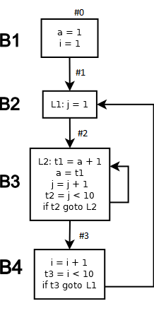

## Вывод
Используя метод, описанные выше, мы смогли выполнить разбиение графa потока управления. 
# Хранение IN-OUT.

## Постановка задачи
Реализовать структуру для хранения множеств IN-OUT для всех базовых блоков программы

## Команда — исполнитель
AW

## Зависимости
Зависит от:
Хранение IN/OUT не зависит от других задач, заполнение IN/OUT зависит от:

- Разбиение на базовые блоки (Enterprise)
- Заполнение множеств GenB и KillB (Kt, Enterprise)

От данной задачи зависят:

- Все дальнейшие задачи и оптимизации, связанные с анализом потока данных
- Все реализации итеративных алгоритмов

## Теория

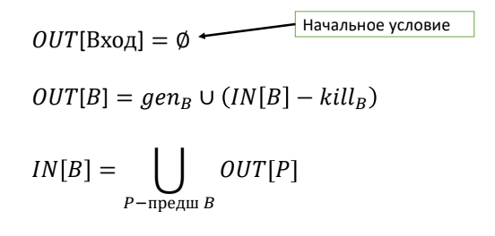

***Оператор сбора*** &mdash; операция над множествами. Для данной задачи оператором сбора является объединение.

## Реализация
Хранение множеств IN и OUT происходит следующим образом:

```csharp
public class InOutContainer<T>
{
    public Dictionary<ThreeAddressCode, HashSet<T>> In = new Dictionary<ThreeAddressCode, HashSet<T>>();

    public Dictionary<ThreeAddressCode, HashSet<T>> Out = new Dictionary<ThreeAddressCode, HashSet<T>>();
    ...
}
```

В качестве дополнения, нами был реализованы методы для нахождения и хранения In-Out по всем базовым блокам с помощью множеств genB и killB в виде класса без дженериков:

```csharp
public Dictionary<OneBasicBlock, HashSet<TacNode>> In = new Dictionary<OneBasicBlock, HashSet<TacNode>>();
public Dictionary<OneBasicBlock, HashSet<TacNode>> Out = new Dictionary<OneBasicBlock, HashSet<TacNode>>();

/// <summary>
/// Построение множеств In и Out на основе gen и kill для каждого базового блока
/// </summary>
/// <param name="bBlocks"> Все базовые блоки </param>
/// <param name="genKillContainers"> Все множества gen и kill по всем базовым блокам </param>
public InOutContainer(BasicBlocks bBlocks,
    Dictionary<OneBasicBlock, IExpressionSetsContainer> genKillContainers)
{
    for (var i = 0; i < bBlocks.BasicBlockItems.Count; ++i)
    {
        var curBlock = bBlocks.BasicBlockItems[i];

        if (i == 0)
        {
            In[curBlock] = new HashSet<TacNode>();
        }
        else
        {
            var prevBlock = bBlocks.BasicBlockItems[i - 1];
            FillInForBasicBlock(curBlock, prevBlock);
        }

        FillOutForBasicBlock(curBlock, genKillContainers);
    }
}

/// <summary>
/// Заполняем множество In для текущего базового блока
/// Т.к. каждый последующий In - это объединение Out всех предыдущих блоков,
/// то достаточно знать только In и Out предыдущего блока, чтобы получить 
/// значение In текущего блока
/// </summary>
/// <param name="curBlock"> Рассматриваемы базовый блок </param>
/// <param name="prevBlock"> Предыдущий базовый блок </param>
public void FillInForBasicBlock(OneBasicBlock curBlock, OneBasicBlock prevBlock)
{
    In[curBlock] = new HashSet<TacNode>();
    In[curBlock].UnionWith(In[prevBlock]);
    In[curBlock].UnionWith(Out[prevBlock]);
}

/// <summary>
/// Заполняем множество OUT для текущего базового блока
/// </summary>
/// <param name="curBlock"> Рассматриваемы базовый блок </param>
/// <param name="genKillContainers"> Информация о gen и kill </param>
public void FillOutForBasicBlock(OneBasicBlock curBlock,
    Dictionary<OneBasicBlock, IExpressionSetsContainer> genKillContainers)
{
    if (genKillContainers.ContainsKey(curBlock))
    {
        Out[curBlock] = new HashSet<TacNode>(genKillContainers[curBlock].GetFirstSet()
            .Union(In[curBlock]
                .Except(genKillContainers[curBlock].GetSecondSet())));
    }
    else
    {
        Out[curBlock] = new HashSet<TacNode>(In[curBlock]);
    }
}
```

## Тесты
Тест для итеративного алгоритма для достигающих определений
### Input
#### Трехадресный код
```
a = 42
c = 100
t1 = a + 1
tmp = t1
t2 = 1 + a
t3 = t2 > 50
if t3 goto L1
goto L2
L1: t4 = 100 * c
b = t4
L2: i = 0
L3: tmp = a
a = 10
i = i + 1
t5 = i < 100
if t5 goto L3
```
#### Вершины CFG (базовые блоки)
```
#0:
a = 42
c = 100
t1 = a + 1
tmp = t1
t2 = 1 + a
t3 = t2 > 50
if t3 goto L1

#1:
goto L2

#2:
L1: t4 = 100 * c
b = t4

#3:
L2: i = 0

#4:
L3: tmp = a
a = 10
i = i + 1
t5 = i < 100
if t5 goto L3
```

### Output
#### Значения множеств IN/OUT (достигающие определения)
```
--- IN 0 :
null
--- OUT 0:
0)a = 42
1)c = 100
2)t1 = a + 1
3)tmp = t1
4)t2 = 1 + a
5)t3 = t2 > 50

--- IN 1 :
0)a = 42
1)c = 100
2)t1 = a + 1
3)tmp = t1
4)t2 = 1 + a
5)t3 = t2 > 50

--- OUT 1:
0)a = 42
1)c = 100
2)t1 = a + 1
3)tmp = t1
4)t2 = 1 + a
5)t3 = t2 > 50

--- IN 2 :
0)a = 42
1)c = 100
2)t1 = a + 1
3)tmp = t1
4)t2 = 1 + a
5)t3 = t2 > 50

--- OUT 2:
0)L1: t4 = 100 * c
1)b = t4
2)a = 42
3)c = 100
4)t1 = a + 1
5)tmp = t1
6)t2 = 1 + a
7)t3 = t2 > 50

--- IN 3 :
0)a = 42
1)c = 100
2)t1 = a + 1
3)tmp = t1
4)t2 = 1 + a
5)t3 = t2 > 50
6)L1: t4 = 100 * c
7)b = t4

--- OUT 3:
0)L2: i = 0
1)a = 42
2)c = 100
3)t1 = a + 1
4)tmp = t1
5)t2 = 1 + a
6)t3 = t2 > 50
7)L1: t4 = 100 * c
8)b = t4

--- IN 4 :
0)L2: i = 0
1)a = 42
2)c = 100
3)t1 = a + 1
4)tmp = t1
5)t2 = 1 + a
6)t3 = t2 > 50
7)L1: t4 = 100 * c
8)b = t4
9)L3: tmp = a
10)a = 10
11)i = i + 1
12)t5 = i < 100

--- OUT 4:
0)L3: tmp = a
1)a = 10
2)i = i + 1
3)t5 = i < 100
4)c = 100
5)t1 = a + 1
6)t2 = 1 + a
7)t3 = t2 > 50
8)L1: t4 = 100 * c
9)b = t4
```
## Вывод
Используя метод, описанные выше, мы смогли построить множество In-Out для всех базовых блоков. 
# Достигающие определения - genB, killB.

## Постановка задачи
Задача состояла в реализации вычисления множеств `genB ` и `killB`.

## Команда — исполнитель
Enterprise

KT

## Зависимости
Данная задача зависит от задачи генерации базовых блоков.

От задачи зависит:
- Реализация итерационного алгоритма для достигающих определений

## Теория
Определение `d` достигает точки p, если существует путь от точки, непосредственно следующей за `d`, к точке p, такой, что `d` не уничтожается вдоль этого пути. 
GenB – множество определений, генерируемых и не переопределённых базовым блоком B.
KillB – множество остальных определений переменных, определяемых в определениях genB, в других базовых блоках.
Анализ присваиваний должен быть консервативным, то есть если неизвестно, существует ли другое присваивание на пути, то алгоритм должен считать что оно существует.

## Реализация
В результате работы был написан класс, реализующий интерфейс _IGenKillVisitor_. У этого класса есть два метода, _GenerateReachingDefinitionForBlocks_ и _GenerateReachingDefinitionForLine_. Первый генерирует достигающие определения для блоков, второй-для линии трехадресного кода. У этих методов примерно схожий алгоритм: прохождение по каждому блоку (строке) с нахождением genB, далее повторное прохождение с нахождением killB.

## Тесты
Входные блоки:
```
B1:
    i=m-1
    j=n
    a=u1
B2:
    i=i+1
    j=j-1
B3:
    a=u2
B4:
    i=u3
```
Сгенерированные genB и killB:
```
B1 gen:
    i=m-1
    j=n
    a=u1
B1 kill:
    i=i+1
    j=j-1
    a=u2
    i=u3
B2 gen:
    i=i+1
    j=j-1
B2 kill:
    i=m-1
    j=n
    i=u3
B3 gen:
    a=u2
B3 kill:
    a=u1
B4 gen:
    i=u3
B4 kill:
    i=m-1
    i=i+1
```

Входные блоки:
```
B1:
    a=b-2
    c=d+1
B2:
    c=a-1
B3:
    a=d+3
B4:
    b=i
```
Сгенерированные genB и killB:
```
B1 gen:
    a=b-2
    c=d+1
B1 kill:
    c=a-1
    a=d+3
B2 gen:
    c=a-1
B2 kill:
    c=d+1
B3 gen:
    a=d+3
B3 kill:
    a=b-2
B4 gen:
    b=i
B4 kill:

```

## Вывод
В результате работы был написан класс, который вычисляет множества genB и killB. Его работоспособность была успешно протестирована.
# Передаточная функция базового блока В (Вычисление путем композиции).

## Постановка задачи
Задача состояла в реализации вычисления передаточной функции базового блока как композиции передаточных функций для каждой линии трёхадресного кода.

## Команда — исполнитель
Enterprise

## Зависимости
Данная задача зависит от 
- Генерации базовых блоков

От задачи зависит:
- Реализация итерационного алгоритма для достигающих определений

## Теория

Передаточная функция блока вычислялась как композиция передаточных функций для каждой линии трёхадресного кода. Формула для композиции передаточных функций выглядит следующим образом: 

`f1(X) = gen1 ∪ (X − kill1), f2(X) = gen2 ∪ (X − kill2) `

тогда 

`f2(f1(X)) = gen2 ∪ (gen1 ∪ (X − kill1) − kill2) =
= gen2 ∪ (gen1 − kill2) ∪ (X − (kill1 ∪ kill2))`

## Реализация
В процессе решения задачи был создан класс, реализующий интерфейс _ITransmissionFunction_. В нем присутствует метод, принимающий на вход множество `in` и сам блок, для которого нужно вычислить передаточную функцию. Далее происходит обход всех линий трехадресного кода в блоке и подсчет передаточной функции для блока:
```csharp
public HashSet<TacNode> Calculate(HashSet<TacNode> _in, ThreeAddressCode bblock)
        {
            basicBlock = bblock;
            var func = _in;

            foreach (var line in GetBasicBlock())
            {
                var gen = new HashSet<TacNode>();
                gen.UnionWith(GetLineGen(line));

                var kill = new HashSet<TacNode>();
                kill.UnionWith(GetLineKill(line));

                var exceptKill = new HashSet<TacNode>();
                exceptKill.UnionWith(func);

                exceptKill.ExceptWith(kill);

                gen.UnionWith(exceptKill);

                func = new HashSet<TacNode>();
                func.UnionWith(gen);
            }

            return func;
        }
```

## Тесты
Входные блоки:
```
B1:
    i=m-1
    j=n
    a=u1
B2:
    i=i+1
    j=j-1
B3:
    a=u2
B4:
    i=u3
```
Вывод передаточной функции для B1:
```
    i=m-1
    j=n
    a=u1
```
Вывод передаточной функции для B2:
```
    i=i+1
    j=j-1
```
Вывод передаточной функции для B4:
```
    i=u3
```   

## Вывод
В результате работы был написан класс, который вычисляет передаточную функцию для базового блока как композицию передаточных функций для каждой линии трехадресного кода. Его работоспособность была успешно протестирована.
# Передаточная функция базового блока В (Вычисление путем применения явных формул).

## Постановка задачи 
Вычисление передаточной функции по явным формулам.

## Команда — исполнитель
kt 

## Зависимости
Зависит от:
- Трехадресный код

## Теория
&mdash;

## Реализация

```csharp
public class TFByCommonWay : ITransmissionFunction<TacNode>
    {
        private ThreeAddressCode basicBlock;
        private Dictionary<ThreeAddressCode, IExpressionSetsContainer> lineGenKill;

        public TFByCommonWay(Dictionary<ThreeAddressCode, IExpressionSetsContainer> LineGenKill)
        {
            lineGenKill = LineGenKill;
        }

        public HashSet<TacNode> Calculate(HashSet<TacNode> _in, ThreeAddressCode bblock)
        {
            basicBlock = bblock;
            var genBlock = new HashSet<TacNode>();
            var killBlock = new HashSet<TacNode>();

            var lines = new List<TacNode>();
            var n = GetBasicBlock().TACodeLines.Count - 1;

            //подсчет kill по формуле killB = kill1 + kill2 + ... + killN
            foreach (var line in GetBasicBlock())
            {
                lines.Add(line);
                killBlock.UnionWith(GetLineKill(line));
            }

            //подсчет gen по формуле genB = gen(n - i) - kill(n - i + 1) - ... - kill(n)
            genBlock.UnionWith(GetLineGen(lines[n])); //gen(n)

            for (int i = n - 1;  i >= 0; i--)
            {
                var tGen = new HashSet<TacNode>();
                tGen.UnionWith(GetLineGen(lines[i]));//gen(n - i)

                for(int j = i + 1; j < n; j++)
                {
                    tGen.ExceptWith(GetLineKill(lines[j]));//kill(n - i + j)
                }
            }


            var exceptX = _in;
            exceptX.ExceptWith(killBlock);
            genBlock.UnionWith(exceptX);

            return genBlock;
        }

        public ThreeAddressCode GetBasicBlock()
        {
            return basicBlock;
        }

        public HashSet<TacNode> GetLineGen(TacNode tacNode)
        {
            return lineGenKill[basicBlock].GetFirstSet();
        }

        public HashSet<TacNode> GetLineKill(TacNode tacNode)
        {
            return lineGenKill[basicBlock].GetSecondSet();
        }
    }
```

## Тесты
&mdash;

## Вывод
Используя методы, описанные выше, мы смогли выполнить задачу. 

# Вычисление множеств def и use для активных переменных.

## Постановка задачи
Реализовать пару множеств Use(B) и Def(B)
## Команда — исполнитель
M&M

## Зависимости
Зависит от  
- Базовых блоков  
- Трехадресного кода

## Теория
В точке p переменная x является активной, если существует путь, проходящий через p, начинающийся присваиванием, заканчивается ее использованием и на всем промежутке нет других присваиваний переменной x. 

Def(B) - множество переменных, определенных в базовом блоке до любого их использования.
Существует также альтернитивное определение: Def(B) - множество переменных, определенных в базовом блоке. 

Use(B) - множество переменных, определенных в базовом блоке до любого их определения.
## Реализация

Для решения поставленной задачи был реализован DefUseContainer.

```csharp
class DefUseContainer : IExpressionSetsContainer
{
	//множество переменных, значения которых могут использоваться в B до любого их определения
	public HashSet<TacNodeVarDecorator> use = new HashSet<TacNodeVarDecorator>();
	
	//множество переменных, определённых в B до любого их использования
	public HashSet<TacNodeVarDecorator> def = new HashSet<TacNodeVarDecorator>();
	
	public HashSet<TacNode> GetFirstSet() {
		HashSet<TacNode> res = new HashSet<TacNode>();
		foreach (var el in use)
		res.Add(el);
		return res;
	}
	
	public HashSet<TacNode> GetSecondSet() {
		HashSet<TacNode> res = new HashSet<TacNode>();
		foreach (var el in def)
		res.Add(el);
		return res;
	}
	
	public void AddToFirstSet(TacNode line)
	{
		use.Add(line as TacNodeVarDecorator);
	}
	public void AddToSecondSet(TacNode line)
	{
		def.Add(line as TacNodeVarDecorator);
	}
}
```

## Тесты

Трехадресный код:
```
a = b + c
b = a - d
v = l + c
d = a - d
```
Множество use:
```
{ a, v }
```

Множество def:
```
{ b, c, d, l }
```

## Вывод
Используя методы, описанные выше, мы получили множества Use(B) и Def(B) для активных переменных.
# Итерационный алгоритм для активных переменных.

## Постановка задачи
Реализовать итерационный алгоритм для активных переменных

## Команда — исполнитель
ZG

## Зависимости
Зависит от:
-   Трёхадресный код
-   Граф потоков управления
-   Def-Use
-   Передаточная функция

## Теория
**Определение.** Переменная x активна в точке p если значение x из точки
p может использоваться вдоль некоторого пути, начинающегося в p.<br />
**Определение**<br />
*def_B* - множество переменных, определённых в B до любого их
использования<br />
*use_B* - множество переменных, значения которых могут использоваться
в B до любого их определения<br />

**Алгоритм**<br />
Вход: граф потока управления, в котором для каждого ББл вычислены
def_B и use_B<br />
Выход: Множества переменных, активных на входе IN[B] и на выходе
OUT[B] для всех ББл B


## Реализация
Для решения поставленной задачи был реализован класс ActiveVariablesITA, наследуемый от IterationAlgorithm.
В классе IterationAlgorithm реализован метод `Execute` (более подробно описан [здесь](44-teamZG.md)), который является общим
для всех итерационных алгоритмов. Его результат зависит от способа инициализации множеств `IN[B]` и `OUT[B]`, направления обхода
графа потоков управления, передаточной функции и оператора сбора.<br />
**Параметры итерационного алгоритма для активных переменных**
- Направление: обратное
- Передаточная функция: *use_B ∪ (x - def_B)*
- Оператор сбора: ∪
- Инициализация: IN[B] = ∅

## Тесты
INPUT:
```
x = 10;
a = 5 + x;
b = x;
a = 7;
x = c * 2 - 10;
if (x > 7) {
  a = 8;
}
```
OUTPUT:
```
--- IN 0 :
null
--- OUT 0:
null
--- IN 1 :
null
--- OUT 1:
null
--- IN 2 :
null
--- OUT 2:
null
--- IN 3 :
0)c

--- OUT 3:
null
```

## Вывод
Реализован итерационный алгоритм для активных переменных.
# Протяжка const на основе итеративного алгоритма для достигающих определений.

## Постановка задачи

Реализовать протяжку констант на основе информации о достигающих определениях, полученной с помощью итеративного алгоритма.

## Команда — исполнитель
AW

## Зависимости

Зависит от:

- Построение графа потока управления
- Итеративный алгоритм для достигающих определений
- Хранение множеств IN/OUT

От задачи зависят:

- От задачи не исходят зависимости

## Теория

Протяжка констант &mdash; это одна из важнейших задач в разработке оптимизирующих компиляторов. Она определяется как подстановка вычисленной константы, находящейся в правой части генератора переменной, вместо использований данной переменной всюду в коде программы. 

Одним из осложнений подобного глобального преобразования является неизвестность того факта, что данный генератор достигает данного использования по всем веткам выполнения программы, а не переопределяется в ходе движения по некоторым из них.

Для этого нам необходимо рассмотреть множества IN/OUT для достигающих определений (см. задачу о реализации итеративного алгоритма для достигающих определений), которые строятся для каждого базового блока - вершины графа потока управления.

В данном контексте множество IN_B &mdash; это множество переменных, достигающих начало блока B, а OUT_B &mdash; достигающих его конца. 

Таким образом, если проверить, что все определения, достигающие использования переменной (множество IN_B, для базового блока B), являются константами, равны между собой и мы не встретили переопределение данной переменной ранее в блоке, то это использование является константой и его можно заменить на значение достигающего определения.  

## Реализация

Для реализации был написан класс, который реализует интерфейс `IIterativeAlgorithmOptimizer<TacNode>`. 

Он содержит методы:

- Проверка достигающих оператора определений и возвращение строки трехадресного кода, являющейся генератором константы, либо `null` в случае, когда мы не встретили ее определения либо протяжка невозможна
```csharp
 private static TacAssignmentNode Routine(HashSet<TacNode> inData, string operand)
{
    var reachedDefinitions = new HashSet<TacNode>();
    // Проход по всем записям в множестве IN для текущего блока
    foreach (var entry in inData)
    {
        // Если строка не является оператором присваивания - пропускаем ее анализ
        if (!(entry is TacAssignmentNode assignmentEntry)) continue;
        // Если имя переменной найденного оператора присваивания совпадает с
        // ее использованием (operand)
        if (assignmentEntry.LeftPartIdentifier == operand)
        {
            // Добавляем оператор присваивания в множество достигающих определений этой константы
            reachedDefinitions.Add(assignmentEntry);
        }
    }
    // Слуйчай, если не нашли генератора константы
    if (reachedDefinitions.Count == 0) return null;

    var tmpValue = (reachedDefinitions.First() as TacAssignmentNode);
    // Если нашли единственное определение, либо все найденные определения равны
    // Возвращаем найденный оператор присваивания, в котором определяется константа
    if (reachedDefinitions.Count == 1 || reachedDefinitions.All(entry =>
                    (entry as TacAssignmentNode)?.FirstOperand == tmpValue.FirstOperand
                    && (entry as TacAssignmentNode)?.SecondOperand == tmpValue.SecondOperand
                    && (entry as TacAssignmentNode)?.Operation == tmpValue.Operation))
            {
                // Если это -- определение константы
                if(tmpValue.SecondOperand == null && Utility.Utility.IsNum(tmpValue.FirstOperand))
                    return tmpValue;
            }

    return null;
}
```

- Выполнения оптимизации
```csharp
//
// Определения необходимых внутри оптимизации переменных
// ...

// Цикл по всем вершинам CFG
foreach (var basicBlock in ita.controlFlowGraph.SourceBasicBlocks)
{
    // Цикл по всем строкам базового блока
    foreach (var line in basicBlock)
    {
        if (!(line is TacAssignmentNode assignmentNode)) continue;
        // Добавление оператора в множество просмотренных
        traversedNodesInBlock.Add(assignmentNode);

        var firstOperand = assignmentNode.FirstOperand;
        var secondOperand = assignmentNode.SecondOperand;
        // Если присутствует первый операнд
        if (firstOperand != null && Utility.Utility.IsVariable(firstOperand))
        {
            // Находим определение константы, достигнутое использованием FirstOperand
            var tmpValue = Routine(inData, firstOperand);
            // Если нашли определение и оно -- определение константы
            if (tmpValue != null) 
            {
                // Проверка того, что не произошло переопределения строками ранее в блоке
                var encounteredRedefinition = traversedNodesInBlock.FirstOrDefault(entry =>
                                                    string.Equals(tmpValue.LeftPartIdentifier,
                                                        entry.LeftPartIdentifier)) != null;
                // Проверка того, что это первый блок. 
                // В таком случае нам необходимо переопределение строками ранее, так как IN_0 пуст
                if (!encounteredRedefinition)
                {
                    assignmentNode.FirstOperand = tmpValue.FirstOperand;
                    wasApplied = true;
                }
                // Протягиваем константу в рассматриваемый операнд
                assignmentNode.FirstOperand = tmpValue.FirstOperand;
                wasApplied = true;
            }
        }
        // Аналогично для второго операнда выражения -- SecondOperand
        ...
    }
    // C помощью Def-Use для базового блока протягиваем константы, которые не можем протянуть 
    // с помощью IN-OUT (определена в том же блоке, в котором используется)
    if (!wasApplied)
    {
        defUsePropagated = optimizer.Optimize(basicBlock);
        while (defUsePropagated)
        {
            defUsePropagated = optimizer.Optimize(basicBlock);
        }
    }
}
```
## Тесты
### Input
#### Трехадресный код
```
a = 42
c = 100
t1 = a + 1
tmp = t1
t2 = 1 + a
t3 = t2 > 50
if t3 goto L1
goto L2
L1: t4 = 100 * c
b = t4
L2: i = 0
L3: tmp = a
a = 10
i = i + 1
t5 = i < 100
if t5 goto L3
```
#### Вершины CFG (базовые блоки)
```
#0:
a = 42
c = 100
t1 = a + 1
tmp = t1
t2 = 1 + a
t3 = t2 > 50
if t3 goto L1

#1:
goto L2

#2:
L1: t4 = 100 * c
b = t4

#3:
L2: i = 0

#4:
L3: tmp = a
a = 10
i = i + 1
t5 = i < 100
if t5 goto L3
```

### Output
#### Значения множеств IN/OUT
```
--- IN 0 :
null
--- OUT 0:
0)a = 42
1)c = 100
2)t1 = a + 1
3)tmp = t1
4)t2 = 1 + a
5)t3 = t2 > 50

--- IN 1 :
0)a = 42
1)c = 100
2)t1 = a + 1
3)tmp = t1
4)t2 = 1 + a
5)t3 = t2 > 50

--- OUT 1:
0)a = 42
1)c = 100
2)t1 = a + 1
3)tmp = t1
4)t2 = 1 + a
5)t3 = t2 > 50

--- IN 2 :
0)a = 42
1)c = 100
2)t1 = a + 1
3)tmp = t1
4)t2 = 1 + a
5)t3 = t2 > 50

--- OUT 2:
0)L1: t4 = 100 * c
1)b = t4
2)a = 42
3)c = 100
4)t1 = a + 1
5)tmp = t1
6)t2 = 1 + a
7)t3 = t2 > 50

--- IN 3 :
0)a = 42
1)c = 100
2)t1 = a + 1
3)tmp = t1
4)t2 = 1 + a
5)t3 = t2 > 50
6)L1: t4 = 100 * c
7)b = t4

--- OUT 3:
0)L2: i = 0
1)a = 42
2)c = 100
3)t1 = a + 1
4)tmp = t1
5)t2 = 1 + a
6)t3 = t2 > 50
7)L1: t4 = 100 * c
8)b = t4

--- IN 4 :
0)L2: i = 0
1)a = 42
2)c = 100
3)t1 = a + 1
4)tmp = t1
5)t2 = 1 + a
6)t3 = t2 > 50
7)L1: t4 = 100 * c
8)b = t4
9)L3: tmp = a
10)a = 10
11)i = i + 1
12)t5 = i < 100

--- OUT 4:
0)L3: tmp = a
1)a = 10
2)i = i + 1
3)t5 = i < 100
4)c = 100
5)t1 = a + 1
6)t2 = 1 + a
7)t3 = t2 > 50
8)L1: t4 = 100 * c
9)b = t4
```

#### Трехадресный код
```
a = 42
c = 100
t1 = 42 + 1
tmp = t1
t2 = 1 + 42
t3 = t2 > 50
if t3 goto L1
goto L2
L1: t4 = 100 * 100
b = t4
L2: i = 0
L3: tmp = a
a = 10
i = i + 1
t5 = i < 100
if t5 goto L3

```
## Вывод

Был реализован класс для проведения глобальной протяжки констант на основе информации о достигающих определениях, полученных с помощью итеративного алгоритма.

Его работоспособнасть была успешно протестирована. 
# Удаление мертвого кода на основе ИТА для активных переменных.

## Постановка задачи
Необходимо реализовать алгоритм удаления мертвого кода на основе ИТА для активных переменных

## Команда — исполнитель
TZ

## Зависимости
Зависит от:
 - ИТА для активных переменных.

## Теория
Алгоритм удаления мертвого кода на основе ИТА для активных переменных позволяет избавиться от допущения, принимаемого в алгоритме удаления мертвого кода для произвольного блока. А именно то, что все переменные на выходе блока считаются живыми.

## Реализация
Для того, чтобы избавиться от упомянутого выше допущения, была переопределена функция инициализации состояний переменных. Переменные объявляются мертвыми, если об обратном нам не говорит их наличие в OUT текущего блока.
```csharp
foreach (var item in outData)
            {
                if (result.ContainsKey(item.ToString()))
                    result[item.ToString()] = true;
            }
```
## Тесты
```csharp
public void Optimize_SimpleBlock()
        {
            TmpNameManager.Instance.Drop();
            /*
             *  
	            x = a;  To be removed
                x = b;
                y = x + 1;
            */

            var tacContainer = new ThreeAddressCode();
            Utils.AddAssignmentNode(tacContainer, null, "x", "a");
            Utils.AddAssignmentNode(tacContainer, null, "x", "b");
            Utils.AddAssignmentNode(tacContainer, null, "y", "x", "+", "1");
            Utils.AddAssignmentNode(tacContainer, null, "e", "d", "*", "a");

            var expectedResult = new ThreeAddressCode();
            Utils.AddAssignmentNode(expectedResult, null, "x", "b");
            Utils.AddAssignmentNode(expectedResult, null, "y", "x", "+", "1");
            Utils.AddAssignmentNode(expectedResult, null, "e", "d", "*", "a");

            var optimization = new DeadCodeOptimization();

            var isOptimized = optimization.Optimize(tacContainer);

            Assert.IsTrue(isOptimized);
            Assert.AreEqual(tacContainer.ToString(), expectedResult.ToString());
            isOptimized = optimization.Optimize(tacContainer);
            Assert.IsFalse(isOptimized);

        }
```
## Вывод
Используя метод, описанные выше, мы смогли использовать удаление мертвого кода на основе ИТА для активных переменных. Что позволило удалять мертвый код, находящийся в конце блока.
# Итерационный алгоритм для достигающих определений.

## Постановка задачи
Реалзовать итерационный алгоритм для достигающих определений.

## Команда — исполнитель
Null

## Зависимости
Зависит от:
- Обобщенный ИТА
- Генерация множеств gen и kill
- Разбиение на базовые блоки

## Теория
**Определение:** Будем говорить, что определение d достигает точки p,
если существует путь от точки, непосредственно следующей за d, к
точке p, такой, что d не уничтожается вдоль этого пути.
Анализ должен быть консервативным: если не знаем, есть ли другое
присваивание на пути, то считаем, что существует.

Достигающие определения используются при:
- Является ли x константой в точке p? (если p достигает одно
определение x, и это – определение константы)
- Является ли x в точке p неинициализированной? (если p не
достигает ни одно определение x)

Передаточная функция в общем случае для достигающих определений:
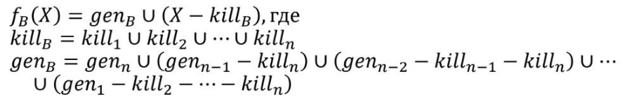

Оператор сбора для достигающих определений:
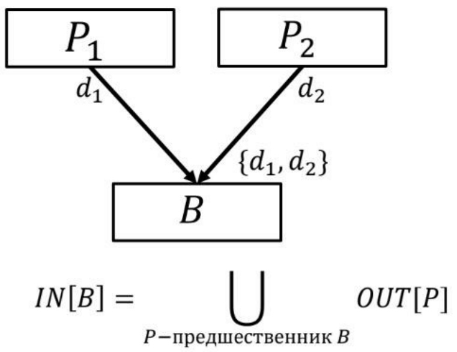

Уравнения для достигающих определений:
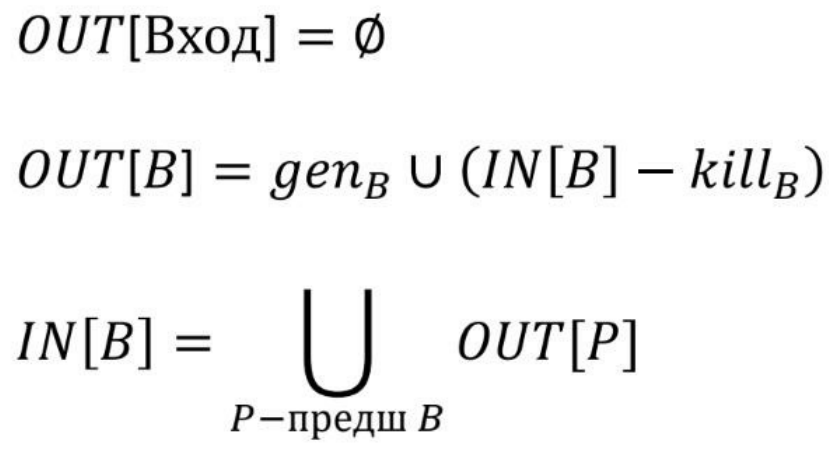

Итеративный алгоритм:

**Вход:** граф потока управления, в котором для каждого ББл вычислены
*genB* и *killB*

**Выход:** Множества достигающих определений на входе *IN[B]* и на
выходе *OUT[B]* для каждого ББл B

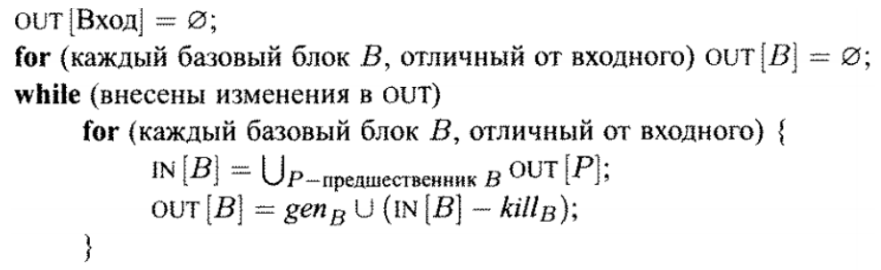

**Сходимость алгоритма:** на каждом шаге *IN[B]* и *OUT[B]* не
уменьшаются для всех B и ограничены сверху, поэтому алгоритм
сходится.

## Реализация
Алгоритм реализован в соответствии со схемой, приведенной выше.

```csharp
public class ReachingDefinitionsITA : IterationAlgorithm<TacNode>
{
	public ReachingDefinitionsITA(
			ControlFlowGraph cfg,
			Dictionary<ThreeAddressCode, IExpressionSetsContainer> lines
			) : base(cfg, new TFByComposition(lines), new UnionCollectionOperator<TacNode>())
    {
        Execute();
	}
```
## Тесты

INPUT:

```
a = 1;
for (i = 1 to 10)
	for (j = 1 to 10)
		a = a + 1;
```
OUTPUT:

```

	#0:
0.0: a = 1  
0.1: i = 1  

	#1:
1.0: L1: j = 1  

	#2:
2.0: L2: t1 = a + 1
2.1: a = t1  
2.2: j = j + 1
2.3: t2 = j < 10
	    if t2 goto L2

	#3:
3.0: i = i + 1
3.1: t3 = i < 10
	    if t3 goto L1
		
Gen/Kill
		
Gen[0] = {0.0, 0,1}
Kill[0] = {2.1, 3.0}

Gen[1] = {1.0}
Kill[1] = {2.2}

Gen[2] = {2.0, 2.1, 2.2, 2.3}
Kill[2] = {0.0, 1.0}

Gen[3] = {3.0, 3,1}
Kill[3] = {2.1, 3.0}

IN/OUT

OUT[0] = {0.1}

IN[1] = {0.0, 0.1, 2.0, 2.1, 2.2, 2.3, 3.0, 3.1}
OUT[1] = {0.0, 0.1, 1.0, 2.0, 2.1, 2.3, 3.0, 3.1}


IN[2] = {0.0, 0.1, 1.0, 2.0, 2.1, 2.2, 2.3, 3.0,3.1}
OUT[2] = {0.1, 2.0, 2.1, 2.2, 2.3, 3.0, 3,1}


IN[3] = {0.1, 2.0, 2.1, 2.2, 2.3, 3.0, 3.1}
OUT[3] = {2.0, 2.1, 2.2, 2.3, 3.0, 3.1}
```
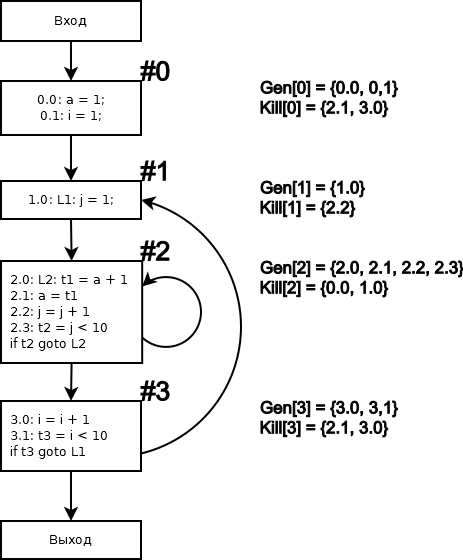

## Вывод
Используя метод, описанные выше, мы смогли реалзовать итерационный алгоритм для достигающих определений.
# Итерационный алгоритм для доступных выражений.

## Постановка задачи
Реализовать итерационный алгоритм для доступных выражений

## Команда — исполнитель
ZG

## Зависимости
Зависит от:
-   Трёхадресный код
-   Граф потоков управления
-   Def-Use
-   Передаточная функция

## Теория
**Определение.** x+y доступно в точке p, если любой путь от входа к p
вычисляет x+y и после последнего вычисления до достижения p нет
присваиваний x и y.<br />
**Определение**<br />
Блок уничтожает выражение x+y,
если он присваивает x или y и потом
не перевычисляет x+y.<br />
*e_killB* − множество всех выражений,
уничтожаемых блоком B.<br />
**Определение**<br />
Блок генерирует выражение x+y,
если он вычисляет x+y и потом не
переопределяет x и y.<br />
*e_genB* − множество всех выражений,
генерируемых блоком B.<br />
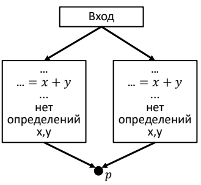

**Алгоритм**<br />
Вход: граф потока управления, в котором для каждого ББл вычислены
e_genB и e_killB<br />
Выход: Множества выражений, доступных на входе IN[B] и на выходе OUT[B]
для всех ББл B
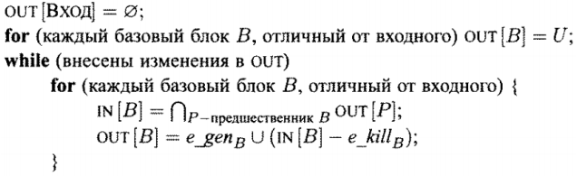<br />
*U* – универсальное множество всех выражений, появляющихся в правых
частях

## Реализация
Для решения поставленной задачи был реализован класс AvailableExpressionsITA, наследуемый от IterationAlgorithm.
В классе IterationAlgorithm реализован метод `Execute` (более подробно описан [здесь](44-teamZG.md)), который является общим
для всех итерационных алгоритмов. Его результат зависит от способа инициализации множеств `IN[B]` и `OUT[B]`, направления обхода
графа потоков управления, передаточной функции и оператора сбора.<br />
**Параметры итерационного алгоритма для доступных выражений**
- Направление: прямое
- Передаточная функция: *e_genB ∪ (x - e_killB)*
- Оператор сбора: ∩
- Инициализация: IN[B] = *U*

## Тесты
INPUT:
```
BLOCK0:
a = 9
t1 = 9 > 5
if t1 goto L1
BLOCK1:
goto L2
BLOCK2:
L1: goto l1
BLOCK3:
L2: b = 8
t2 = 9 + b
c = t2
BLOCK4:
l1: a = 15
```

OUTPUT:
```
--- IN 0 :
null
--- OUT 0:
0)t1 = 9 > 5

--- IN 1 :
0)t1 = 9 > 5

--- OUT 1:
0)t1 = 9 > 5

--- IN 2 :
0)t1 = 9 > 5

--- OUT 2:
0)t1 = 9 > 5

--- IN 3 :
0)t1 = 9 > 5

--- OUT 3:
0)t2 = 9 + b
1)t1 = 9 > 5

--- IN 4 :
0)t1 = 9 > 5

--- OUT 4:
0)t1 = 9 > 5
```

## Вывод
Реализован итерационный алгоритм для доступных выражений.
# Провести оптимизации на основе анализа доступных выражений.

## Постановка задачи
Реализовать оптимизации на основе анализа доступных выражений.
## Команда — исполнитель
M&M

## Зависимости
Зависит от  
- Базовых блоков  
- Трехадресного кода  
- Графа потока управления


## Теория
&mdash;

**Определение.** x+y доступно в точке p если любой путь от входа к p
вычисляет x+y и после последнего вычисления до достижения p нет
присваиваний x и y.

Оптимизации на основе доступных выражений:
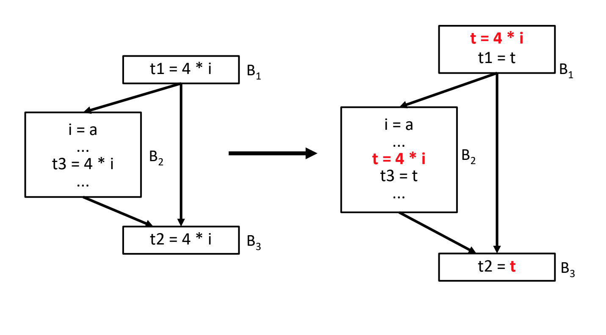

## Реализация

Для решения поставленной задачи был реализован  AvailableExprOptimization:

```csharp
...
// проводим оптимизацию
for (int blockInd = 0; blockInd < bb.BasicBlockItems.Count(); blockInd++)
	{
	var block = bb.BasicBlockItems[blockInd];
	var codeLine = block.TACodeLines.First;
	foreach (var _expr in varsExprChange.Keys.ToArray())
		varsExprChange[_expr] = !IN_EXPR[block].Contains(_expr);
	while (codeLine != null)
	{
		var node = codeLine.Value;
		if (node is TacAssignmentNode assign)
		{
			string assignId = assign.LeftPartIdentifier;
			TacExpr expr = new TacExpr(assign);
			// если выражений больше 1 делаем оптимизацию
			if (tacExprCount.Keys.Contains(expr) && tacExprCount[expr] > 1)
			{
				isUsed = true;
				if (!varsExprChange.Keys.Contains(expr))
					varsExprChange.Add(expr, !IN_EXPR[block].Contains(expr));
			// если это первая замена общего выражения
			if (!idsForExprDic.Keys.Contains(expr))
			{
			// создаём переменную для общего выражения
				string idName = TmpNameManager.Instance.GenerateTmpVariableName();
				idsForExprDic.Add(expr, idName);
				block.TACodeLines.AddBefore(block.TACodeLines.Find(node), expr.CreateAssignNode(idName));
				AssignRightPartVarReplace(assign, idName);
				varsExprChange[expr] = false;
			} else
			{
				string idName = idsForExprDic[expr];
				// если это не замена общего выражения
				if (assignId != idName)
					AssignRightPartVarReplace(assign, idName);
				// если выражение недоступно на входе
				if (varsExprChange[expr])
					{
						block.TACodeLines.AddBefore(block.TACodeLines.Find(node), expr.CreateAssignNode(idName));
						varsExprChange[expr] = false;
					}
				}
			}
			// для всех оптимизируемых выражений
			foreach (var _expr in varsExprChange.Keys.ToArray())
			{
			// если выражение недоступно на выходе и присваивание его изменяет
				if (_expr.FirstOperand == assignId || _expr.SecondOperand == assignId)
				{
					varsExprChange[_expr] = true;
				}
			}
		}
		codeLine = codeLine.Next;
	}
}
...
```

## Тесты

Source Code:
```
a1 = 4 * i; 
if (b) { 
  a3 = 4 * i;
} 
a2 = 4 * i;         
```
Before AvailableExprOptimization

```
BLOCK0:
t1 = 4 * i
a1 = t1
if t4 goto L2
BLOCK1:
goto L2
BLOCK2:
L1: t2 = 4 * i
a3 = t2
BLOCK3:
L2: t3 = 4 * i
a2 = t3
```
After AvailableExprOptimization

```
BLOCK0:
t5 = 4 * i
t1 = t5
a1 = t1
if t4 goto L2
BLOCK1:
goto L2
BLOCK2:
L1: t2 = t5
a3 = t2
BLOCK3:
L2: t3 = t5
a2 = t3
```
## Вывод
Используя методы, описанные выше, мы получили оптимизации на основе анализа доступных выражений
# Доступные выраж.-множества e_genB, e_killB. Передаточная ф-ия ББЛ в fB = e_genB U (x - e_killB).

## Постановка задачи
Необходимо реализовать алгоритм заполнения множеств e_genB и e_killB, а так же определить передаточную функцию для ИТА.

## Команда — исполнитель
TZ

## Зависимости
От данной задачи зависит команда ЗГ, задача ИТА для доступных выражений.

## Теория
**Определение.** x+y доступно в точке p если любой путь от входа к p
вычисляет x+y и после последнего вычисления до достижения p нет
присваиваний x и y

**Определение.** Множество **e_genB** представляет собой все выражения определеные в блоке, такие что в случае переопределенния одного из операндов выражения, выражение было вычеслено вновь.

**Определение.** Множество **e_killB** представляет собой все выражения, уничтоженные операциями присваивания. В том числе, из других блоков.

## Реализация
Для заполнения множества e_killB нам потребуется универсальное множество - множество, которое содержит все выражения кода.
```csharp
public HashSet<TacNode> FillUniversalSet(BasicBlocks bblocks)
        {
            var uSet = new HashSet<TacNode>();
            foreach (var bblock in bblocks)
            {
                foreach (var line in bblock)
                {
                    if (line is TacAssignmentNode assignmentNode)
                    {
                        uSet.Add(line);
                    }
                }
            }
            return uSet;
        }
```

Проходя по всем линиям трехадресного кода, мы обрабатываем только объекты AssignmentNode. В случае, когда левая часть (объект которому присваивается выражение) является временной переменной, мы добавляем выражение во множество e_genB и удаляем e_killB.
Если же левая часть является обычной переменной, мы выполняем обратное действие
```csharp
...........
if (line is TacAssignmentNode assignmentNode)
                    {
                        if (IsTempVariable(assignmentNode.LeftPartIdentifier))
                        {
                            genSet1.Add(line);
                            killSet1.Remove(line);
                        }
                        else
                        {
                            AddToKill(killSet1, uSet, assignmentNode.LeftPartIdentifier);
                            DeleteFromGen(ref genSet1, assignmentNode.LeftPartIdentifier);
                        }
...........
```
Учитывая специфику реализации, для определения передаточной функции от нас потребовалось только переопределить операцию Intersection для HashSet<TacNode>:
```csharp
public class IntersectCollectionOperator<TacNode> : ICollectionOperator<TacNode>
    {
        private HashSet<TacNode> IntersectAvailableExpressions(HashSet<TacNode> firstSet, HashSet<TacNode> secondSet)
        {
            var res = new HashSet<TacNode>();
            foreach (var item1 in firstSet)
                foreach (var item2 in secondSet)
                    if ((item1 as TacAssignmentNode).FirstOperand == (item2 as TacAssignmentNode).FirstOperand && 
                        (item1 as TacAssignmentNode).Operation == (item2 as TacAssignmentNode).Operation &&
                        (item1 as TacAssignmentNode).SecondOperand == (item2 as TacAssignmentNode).SecondOperand)
                    {
                        res.Add(item1);
                    }
            return res;
        }
        public HashSet<TacNode> Collect(HashSet<TacNode> firstSet, HashSet<TacNode> secondSet)
        {         
            return IntersectAvailableExpressions(firstSet as HashSet<TacNode>, secondSet as HashSet<TacNode>);
        }
    }
```
## Тесты
```csharp
IN:
x = b;
x = a;
if (1==1)
{
    x = b;
    y = x;
} 
x = 1;
v = x;

OUT:
if (1==1)
{
    x = b;
    y = x;
} 
x = 1;
v = x;

```
## Вывод
Используя метод, описанные выше, нам удалось реализовать алгоритм заполнения множеств e_genB и e_killB.
# Общий класс для передаточной функции.

## Постановка задачи
Задача состояла в организиции удобного доступа к передаточной функции.

## Команда — исполнитель
Enterprise

## Зависимости
Данная задача зависит от
- Реализации передаточной функции

## Теория
&mdash;

## Реализация
Для того что бы унифицировть доступ к передаточной функции был создан интрефейс с дженерик параметром.
```csharp
public interface ITransmissionFunction<T>
{
    HashSet<T> Calculate(HashSet<T> _in, ThreeAddressCode bbloc);

    HashSet<T> GetLineGen(T tacNode);
    HashSet<T> GetLineKill(T tacNode);

    ThreeAddressCode GetBasicBlock();
}
```
Каждый кто хочет определить свою передаточную функцию, должен реализовать этот интерфейс в классе своей передаточной функции.

## Тесты
&mdash;

## Вывод
В результате работы был организован удобный и легковесный способ реализации общего класса передаточной функции.
# Обобщённый итерационный алгоритм. Распространение констант.

## Постановка задачи
Реализовать обобщенный итерационный алгоритм и заменить в программе переменные,
имеющие константное значение, на константу.

## Команда — исполнитель
ZG

## Зависимости
Зависит от:
-   Трёхадресный код
-   Граф потоков управления
-   Def-Use
-   Передаточная функция

## Теория
**Обобщенный итерационный алгоритм**<br />
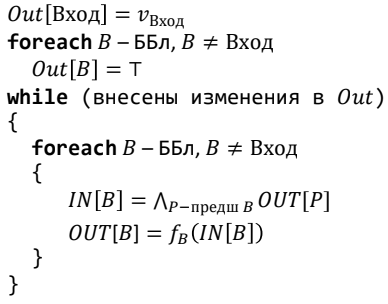<br />
**Распространение констант**<br />
**Определение.** Замена переменных, имеющих константное значение, на константу.<br />
**Передаточная функция**<br />
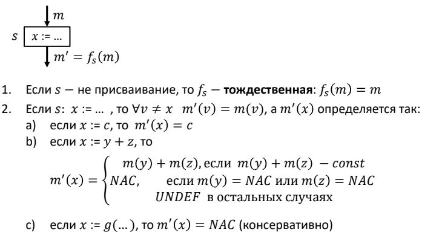<br />

**Итерационный алгоритм для задачи распространения констант**<br />
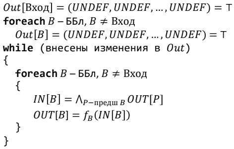<br />


## Реализация
Для решения поставленной задачи был реализован класс IterationAlgorithm.
В классе IterationAlgorithm реализован метод `Execute`, который является общим
для всех итерационных алгоритмов. Его результат зависит от способа инициализации множеств `IN[B]` и `OUT[B]`, направления обхода
графа потоков управления, передаточной функции и оператора сбора.<br />
Для начала инициализируем множество OUT[B]:
```csharp
foreach(var vertex in vertices)
{
    InOut.Out[vertex] = InitilizationSet;
}
```
Пока внесены изменения в OUT выполняем:
```csharp
while (isChanged)
{
   isChanged = false;
   foreach(var vertex in vertices)
   {
       var pred = (entryPoints.Contains(vertex))?
           new HashSet<T>() :
           GetPredVertices(vertex)
           .Select(e => InOut.Out[e])
           .Aggregate((a,b) => CollectionOperator(a,b));

       InOut.In[vertex] = pred;
       var tmp = InOut.Out[vertex];
       InOut.Out[vertex] = TransmissionFunc(InOut.In[vertex], vertex);
       if (!tmp.SequenceEqual(InOut.Out[vertex]))
       {
           isChanged = true;
       }
   }
}
```
Для решения задачи распространения констант был реализован класс ConstDistributionITA, наследуемый от IterationAlgorithm.
Алгоритм аналогичен вышеописанному. В качестве передаточной функции использует класс ConstDistribFunction, в качестве оператора сбора -
ConstDistribOperator.
## Тесты
&mdash;

## Вывод
Реализован обобщенный итерационный алгоритм и итерационный алгоритм для задачи распространения констант.
# Оператор сбора /\ и отображение m в задаче о распространении констант.

## Постановка задачи
Реализовать оператор сбора /\ и отображение m в задаче о распространении констант
## Команда — исполнитель
Kt

## Зависимости
Зависит от  
- Базовых блоков  
- Трехадресного кода  
- Графа потока управления 

## Теория
Для одной переменной x – значения в полурешётке V:

1. все константы данного типа
2. NAC (Not A Constant) – либо переменной было присвоена не
константа, либо по разным веткам – разные константы
3. UNDEF (неизвестно пока, является ли константой)

Оператор сбора на полурешетке V:

- UNDEF ∧ v = v (v − переменная)
- NAC ∧ v = NAC
- c ∧ c = c
- c1 ∧ c2 = NAC
## Реализация

Для решения поставленной задачи был реализован следующий метод :

```csharp
...
// Реализация оператора ^
public static SemilatticeValue operator ^(SemilatticeValue c1, SemilatticeValue c2)
{
	if (c1.TypeValue == SemilatticeValueEnum.UNDEF && c2.TypeValue == SemilatticeValueEnum.UNDEF)
		return new SemilatticeValue(SemilatticeValueEnum.UNDEF);
	if (c1.TypeValue == SemilatticeValueEnum.CONST && c2.TypeValue == SemilatticeValueEnum.UNDEF)
		return new SemilatticeValue(SemilatticeValueEnum.CONST, c1.ConstValue);
	if (c1.TypeValue == SemilatticeValueEnum.UNDEF && c2.TypeValue == SemilatticeValueEnum.CONST)
		return new SemilatticeValue(SemilatticeValueEnum.CONST, c2.ConstValue);
	if (c1.TypeValue == SemilatticeValueEnum.CONST && c2.TypeValue == SemilatticeValueEnum.CONST && c1.ConstValue == c2.ConstValue)
		return new SemilatticeValue(SemilatticeValueEnum.CONST, c2.ConstValue);
	if (c1.TypeValue == SemilatticeValueEnum.CONST && c2.TypeValue == SemilatticeValueEnum.CONST && c1.ConstValue != c2.ConstValue)
		return new SemilatticeValue(SemilatticeValueEnum.NAC);
	if (c1.TypeValue == SemilatticeValueEnum.NAC || c2.TypeValue == SemilatticeValueEnum.NAC)
		return new SemilatticeValue(SemilatticeValueEnum.NAC);
	return new SemilatticeValue(SemilatticeValueEnum.UNDEF);
}
...
```

## Тесты
```csharp
static public void TestForValueOperator ()
{
	var undef = new SemilatticeValue("");
	Debug.Assert(undef.TypeValue == SemilatticeValueEnum.UNDEF && undef.ConstValue == null);
	var c1 = new SemilatticeValue("123");
	Debug.Assert(c1.TypeValue == SemilatticeValueEnum.CONST && c1.ConstValue == "123");
	var c2 = new SemilatticeValue("456.45");
	Debug.Assert(c2.TypeValue == SemilatticeValueEnum.CONST && c2.ConstValue == "456.45");
	var c3 = new SemilatticeValue("-123");
	Debug.Assert(c3.TypeValue == SemilatticeValueEnum.CONST && c3.ConstValue == "-123");
	var c4 = new SemilatticeValue("123");
	Debug.Assert(c4.TypeValue == SemilatticeValueEnum.CONST && c4.ConstValue == "123");
	var nac = new SemilatticeValue("fun()");
	Debug.Assert(nac.TypeValue == SemilatticeValueEnum.NAC && nac.ConstValue == null);
	var t = c1 ^ undef;
	Debug.Assert(t.TypeValue == SemilatticeValueEnum.CONST && t.ConstValue == "123");
	t = undef ^ c1;
	Debug.Assert(t.TypeValue == SemilatticeValueEnum.CONST && t.ConstValue == "123");
}
```

## Вывод
Используя методы, описанные выше, были реализованы оператор сбора /\ и отображение m в задаче о распространении констант.
# Поиск решения методом MOP.

## Постановка задачи
Задача состояла в реализации поиска решения методом MOP

## Команда — исполнитель
Enterprise

## Зависимости
Данная задача зависит от задачи реализации оператора сбора. 

## Теория
Из-за того, что поиск всех возможных путей выполнения - задача неразрешимая, следовательно требуется поиск приближенного решения.
Решение сбором по путям (Meet Over Paths, MOP) – это решение, получаемое применением оператора сбора по всем путям, ведущим ко входу в блок B. Основная форма метода MOP: 
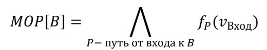

Рассматриваемые в решении MOP пути представляют собой надмножетсво всех путей, которые могут быть выполнены, следовательно MOP[B] включает больше путей, чем IDEAL[B], в том числе заведомо невыполнимые пути, поэтому `MOP[B] ≤ IDEAL[B]`. 

Решение максимальной фиксированной точки (MFP) – это решение IN[B] ,
полученное итерационным алгоритмом: `MOP[B] ≤ IDEAL[B]`.

## Реализация
В процессе решения задачи был создан класс, реализующий интерфейс _IIterationAlgorithm_. В нем присутствует главный метод _Compute_, в котором происходит обход по всему графу потока управления:
```csharp
    while (isChanged)
            {
                var predecessors = new Stack<ThreeAddressCode>();
                var outBefore = new Dictionary<ThreeAddressCode, HashSet<TacNode>>(InOut.Out);
                if (IsForwardDirection)
                    DepthFirstSearch(entryBlock, visited, predecessors, ControlFlowGraph.IsOutEdgesEmpty, ControlFlowGraph.OutEdges);
                else DepthFirstSearch(entryBlock, visited, predecessors, ControlFlowGraph.IsInEdgesEmpty, ControlFlowGraph.InEdges);

                isChanged = false;
                foreach (var _out in InOut.Out)
                {
                    var key = _out.Key;
                    isChanged = isChanged || !_out.Value.SequenceEqual(outBefore[key]);
                }
            }
```
В этом участке кода вызывается метод _DepthFirstSearch_, который обходит граф потока управления в глубину:
```csharp
visited[currentBlock] = true;

            var collectionOperatorResult = new HashSet<TacNode>();
            if (predecessors.Count > 0)
                collectionOperatorResult = predecessors
                .Select(e => InOut.Out[e])
                .Aggregate((a, b) => CollectionOperator.Collect(a, b));

            InOut.In[currentBlock] = CollectionOperator.Collect(collectionOperatorResult, InOut.In[currentBlock]);
            var outBefore = InOut.Out[currentBlock];
            InOut.Out[currentBlock] = TransmissionFunction.Calculate(InOut.In[currentBlock], currentBlock);

```

## Тесты
Граф потока управления:
```
VERTICES
#0:
c = 123  
t4 = 1 + c
t5 = t4 + y
m = t5  
t6 = m > 2
if t6 goto L3

#1:
c = 456  
goto L4

#2:
L3: c = 3  

#3:
L4: a = 11  

EDGES
0 -> [ 1 2 ]
1 -> [ 3 ]
2 -> [ 3 ]
3 -> [ ]

```
IN и OUT для достигающий определений последнего базового блока:
```
IN:
    c=456
    t1 = 1+c
    t2 = t1+y
    m = t2
    t3 = m > 2
    c = 123
    L1: c = 3
OUT:
    L2: a = 11
    c = 456
    t1 = 1+c
    t2 = t1+y
    m = t2
    t3 = m>2
    c = 123
    L1: c = 3
```

IN и OUT для активных переменных для первого базового блока:
```
IN: y
OUT: 
```

## Вывод
В результате работы был написан класс, который реализует поиск решения методом MOP. Его работоспособность была успешно протестирована.
# Построение дерева доминаторов.

## Постановка задачи
Для Control-flow graph построить дерево доминаторов на основе итерационного алгоритма.

## Команда — исполнитель
AW

## Зависимости
Зависит от:
- Трехадресный код 
- Разбиение на базовые блоки
- Обобщенный ИТА
- Хранение IN-OUT

## Теория
Пусть d, n &mdash; вершины Control-flow graph. Будем говорить, что d dom n
(d ***доминирует*** над n) если любой путь от входного узла к n проходит
через d.

Среди всех доминаторов узла будем выделять ***непосредственный
доминатор***: m idom n, обладающий следующими свойствами:
m dom n, m ≠ n и если d dom n, d ≠ n, то d dom m.

***Дерево доминаторов*** &mdash; вспомогательная структура данных, содержащая информацию об отношениях доминирования. 
При этом дуга от узла M к узлу N идет тогда и только тогда, когда M является непосредственным доминатором N.

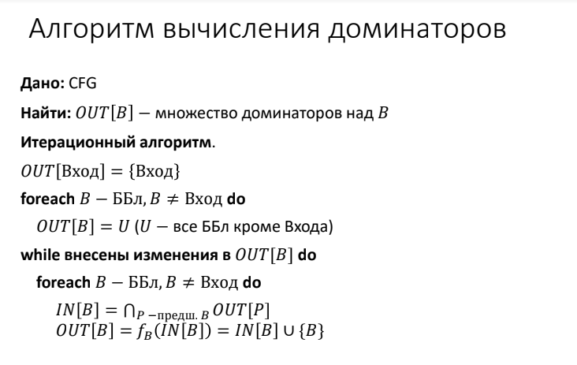

Примечание: здесь p - непосредственно предшествующие блоки.

## Реализация

Для решения данной задачи были созданы два множества доминаторов: 
1. Множество всех доминаторов для каждого базового блока;

```csharp
/// <summary>
/// Все доминаторы
/// Ключ - блок
/// Значение - Все доминаторы текущего блока
/// </summary>
public Dictionary<ThreeAddressCode, HashSet<ThreeAddressCode>> Dominators =
    new Dictionary<ThreeAddressCode, HashSet<ThreeAddressCode>>();
```

2. Множество непосредственных доминаторов для каждого базового блока.

```csharp
/// <summary>
/// Непосредственные доминаторы
/// Ключ - блок
/// Значение - непосредственный доминатор
/// </summary>
public Dictionary<ThreeAddressCode, ThreeAddressCode> ImmediateDominators =
    new Dictionary<ThreeAddressCode, ThreeAddressCode>();
```
---
Оператор сбора имеет вид:
```csharp
/// <summary>
/// Оператор сбора
/// </summary>
private ICollectionOperator<ThreeAddressCode> _collectionOperator =
    new IntersectCollectionOperator<ThreeAddressCode>();
```

Метод для построения дерева доминаторов:
```csharp
// entryPoint - входной базовый блок
// threeAddressCodeHashSet - все базовые блоки, кроме входного
// outWasChanged - переменная, которая показывает, были ли произведены 
// какие-либо измения с множеством Out какого-либо базового блока 

public DominatorsFinder(ControlFlowGraph cfg)
{
    ...

    // Для входного узла In - пустой, Out - сам базовый блок
    InOut.In[entryPoint] = new HashSet<ThreeAddressCode>();
    InOut.Out.Add(entryPoint, new HashSet<ThreeAddressCode>() {entryPoint});
    ImmediateDominators[entryPoint] = entryPoint;

    // Для всех ББл, кроме входного, Out явл. множеством всех ББл, кроме входного
    foreach (var basicBlock in cfg.SourceBasicBlocks)
    {
        if (basicBlock == entryPoint) continue;
        InOut.Out[basicBlock] = threeAddressCodeHashSet; 
    }

    ...

    // Цикл: пока вносятся изменения в Out хотя бы одного базового блока
    while (outWasChanged)
    {
        outWasChanged = false;
        for (var i = 1; i < vertices.Count; ++i)
        {
            var curBlock = vertices[i];

            // Предки текущего узла
            var ancestors = cfg.Edges.Where(edge => edge.Target == curBlock).Select(e => e.Source).ToList();

#region All Dominators 
            InOut.In[curBlock] = new HashSet<ThreeAddressCode>();
            InOut.In[curBlock] = InOut.Out[ancestors[0]];

            // Если несколько непосредственных предков
            if (ancestors.Count > 1) { 
                for (int ind = 1; ind < ancestors.Count; ++ind) {
                    if (curBlock == ancestors[ind]) continue;
                    InOut.In[curBlock] = _collectionOperator.Collect(InOut.In[curBlock], InOut.Out[ancestors[ind]]);
                }
            }

            InOut.Out[curBlock] = new HashSet<ThreeAddressCode>(InOut.In[curBlock].Union(new HashSet<ThreeAddressCode>(){curBlock}));
#endregion
            ...

#region Immediate Dominators
            // Находим непосредственных доминаоров, т.е. доминаторов не являющихся:
            // 1) рассматриваемым узлом;
            // 2) доминатором над каким-либо из доминаторов данного узла
            var immediateDomsCurBlock = InOut.Out[curBlock].Where(block => block != curBlock).Select(p => p).ToList();
            var needToDeleteElems = new List<ThreeAddressCode>();
            foreach (var dom in immediateDomsCurBlock) {
                if (immediateDomsCurBlock.Contains(ImmediateDominators[dom]) && ImmediateDominators[dom] != dom) {
                    needToDeleteElems.Add(ImmediateDominators[dom]);
                }
            }
            needToDeleteElems.Distinct();
            ImmediateDominators[curBlock] = immediateDomsCurBlock
                .Where(d => !needToDeleteElems.Contains(d))
                .FirstOrDefault();
#endregion
            ...
        }
    }
    ImmediateDominators[entryPoint] = null;
    Dominators = InOut.Out;
}
```

## Тесты
#### INPUT: 
```csharp
c = 2 > 3;
a = 120;
tmp1 = a;
tmp = 101;
if (c) { 
  b = 3; 
}
i = 0;
for ( i = 0 to 3) { 
  c = c + 1;
  b = c + tmp;
  d = a + 1; 
}
b = a + c;
a = 2;
c = 0; 
a = 11;
```

#### Three address code:
```csharp
t1 = 2 > 3
c = t1
a = 120
tmp1 = a
tmp = 101
t2 = c
if t2 goto L1
goto L2
L1: b = 3
L2: i = 0
i = 0
L3: t3 = c + 1
c = t3
t4 = c + tmp
b = t4
t5 = a + 1
d = t5
i = i + 1
t6 = i < 3
if t6 goto L3
t7 = a + c
b = t7
a = 2
c = 0
a = 11
```

### Control-flow graph
Вершины Control-flow graph являются базовыми блоками программы. 
```csharp
VERTICES
#0:
t1 = 2 > 3
c = t1
a = 120
tmp1 = a
tmp = 101
t2 = c
if t2 goto L1

#1:
goto L2

#2:
L1: b = 3

#3:
L2: i = 0
i = 0

#4:
L3: t3 = c + 1
c = t3
t4 = c + tmp
b = t4
t5 = a + 1
d = t5
i = i + 1
t6 = i < 3
if t6 goto L3

#5:
t7 = a + c
b = t7
a = 2
c = 0
a = 11

EDGES
0 -> [ 1 2 ]
1 -> [ 3 ]
2 -> [ 3 ]
3 -> [ 4 ]
4 -> [ 5 4 ]
5 -> [ ]
```

#### OUTPUT:

Все доминаторы для каждого базового блока:
```csharp
Block 0:
Dominators:
t1 = 2 > 3
c = t1
a = 120
tmp1 = 120
tmp = 101
t2 = c
if t2 goto L1
```
```csharp
Block 1:
Dominators:
t1 = 2 > 3
c = t1
a = 120
tmp1 = 120
tmp = 101
t2 = c
if t2 goto L1

goto L2
```
```csharp
Block 2:
Dominators:
t1 = 2 > 3
c = t1
a = 120
tmp1 = 120
tmp = 101
t2 = c
if t2 goto L1

L1: b = 3
```
```csharp
Block 3:
Dominators:
t1 = 2 > 3
c = t1
a = 120
tmp1 = 120
tmp = 101
t2 = c
if t2 goto L1

L2: i = 0
i = 0
```
```csharp
Block 4:
Dominators:
t1 = 2 > 3
c = t1
a = 120
tmp1 = 120
tmp = 101
t2 = c
if t2 goto L1

L2: i = 0
i = 0

L3: t3 = c + 1
c = t3
t4 = c + 101
b = t4
t5 = 120 + 1
d = t5
i = i + 1
t6 = i < 3
if t6 goto L3
```
```csharp
Block 5:
Dominators:
t1 = 2 > 3
c = t1
a = 120
tmp1 = 120
tmp = 101
t2 = c
if t2 goto L1

L2: i = 0
i = 0

L3: t3 = c + 1
c = t3
t4 = c + 101
b = t4
t5 = 120 + 1
d = t5
i = i + 1
t6 = i < 3
if t6 goto L3

t7 = 120 + c
b = t7
a = 2
c = 0
a = 11
```
---
Непосредственные доминаторы для каждого базового блока:
```csharp
Block 0:
Immediate dominator:
null
```
```csharp
Block 1:
Immediate dominator:
t1 = 2 > 3
c = t1
a = 120
tmp1 = 120
tmp = 101
t2 = c
if t2 goto L1
```
```csharp
Block 2:
Immediate dominator:
t1 = 2 > 3
c = t1
a = 120
tmp1 = 120
tmp = 101
t2 = c
if t2 goto L1
```
```csharp
Block 3:
Immediate dominator:
t1 = 2 > 3
c = t1
a = 120
tmp1 = 120
tmp = 101
t2 = c
if t2 goto L1
```
```csharp
Block 4:
Immediate dominator:
L2: i = 0
i = 0
```
```csharp
Block 5:
Immediate dominator:
L3: t3 = c + 1
c = t3
t4 = c + 101
b = t4
t5 = 120 + 1
d = t5
i = i + 1
t6 = i < 3
if t6 goto L3
```

#### Упрощенный вывод доминаторов:
```csharp
blockInd0:  Dominators: 0        ImmediateDominator: null
blockInd1:  Dominators: 0 1      ImmediateDominator: 0
blockInd2:  Dominators: 0 2      ImmediateDominator: 0
blockInd3:  Dominators: 0 3      ImmediateDominator: 0
blockInd4:  Dominators: 0 3 4    ImmediateDominator: 3
blockInd5:  Dominators: 0 3 4 5  ImmediateDominator: 4
```

## Вывод
Используя метод, описанные выше, было выполнено построение дерева доминаторов (всех и непосредственных) для Control-flow graph.
# Итерационный алгоритм для задачи распространения констант.

## Постановка задачи
Создать класс, реализующий итерационный алгоритм для задачи распостронения
констант

## Команда — исполнитель
Null

## Зависимости
Зависит от:
- Обобщенный итерационный алгоритм
- Передаточная функция для задачи распостронения констант
- Генерация множеств gen и kill
- Разбиение на базовые блоки

## Теория

Введем полурешетку вида:

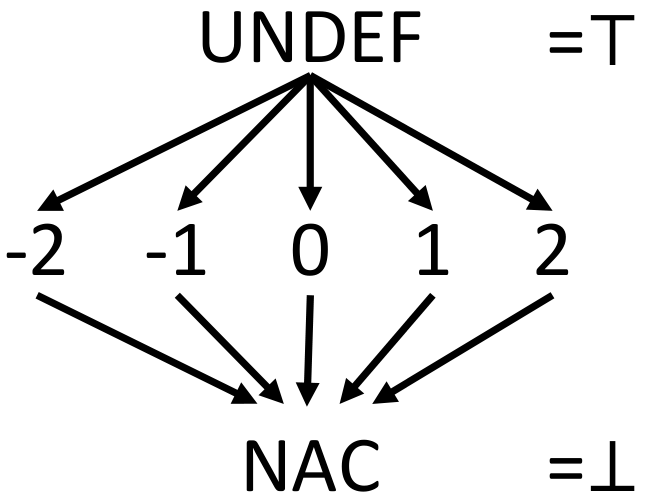

Каждая переменная в некоторой таблице имеет одно из значений в
полурешетке - UNDEF (undefigned), const , NAC (not a const). Таблица
является декартовым произведением полурешеток, и следовательно,
сама полурешетка.

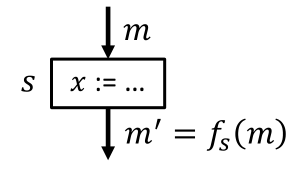

Таким образом, элементом данных будет отображение m на
соответствующее значение полурешетки.

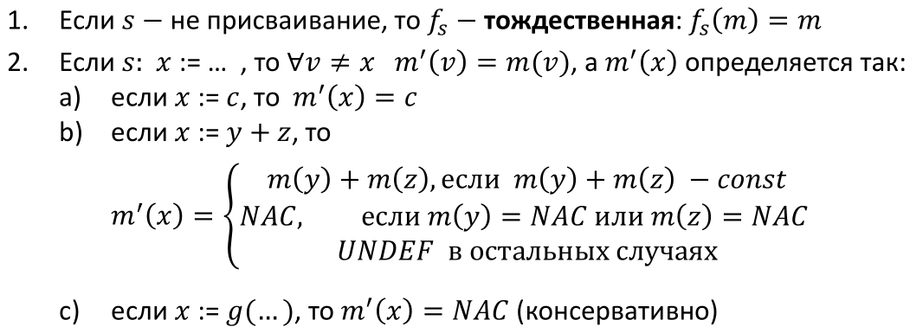

Функция монотонна, потому итерационный процесс решает
поставленную задачу.

## Реализация

```
public class ConstDistributionITA: IterationAlgorithm<SemilatticeStreamValue>
{

public ConstDistributionITA(ControlFlowGraph cfg)
	:base(cfg, new ConstDistribFunction(), new ConstDistribOperator())
{
	InitilizationSet = new HashSet<SemilatticeStreamValue>();
	Execute();
}

}
```

## Тесты

INPUT:
```
a = 4;
b = 4;
c = a + b;
if 1
	a = 3;
else
	b = 2;
```
OUTPUT:
```
["a"] == "4"
["b"] == "4"
["t0"] == "8" 
["c"] == "8"

["a"] == "3" 
["b"] == "4" 
["t0"] == "8" 
["c"] == "8"

["a"] == "4" 
["b"] == "2" 
["t0"] == "8" 
["c"] == "8"

["a"] == "NAC"
["b"] == "NAC" 
["t0"] == "8" 
["c"] == "8"
```

## Вывод
Используя метод, описанные выше, мы смогли реализовать итерационный алгоритм для задачи распостронения
констант
# Передаточная функция в задаче о распространении констант.

## Постановка задачи
Реализовать передаточную функцию для задачи распространения констант.
## Команда — исполнитель
M&M

## Зависимости
Зависит от  
- Базовых блоков  
- Трехадресного кода  
- Графа потока управления
- Оператора сбора /\ и отображение m в задаче о распространении констант 

## Теория

Каждая переменная в некоторой таблице имеет одно из значений в полурешетке - _UNDEF_ (undefigned), _const_, _NAC_ (not a const). Таблица является декартовым произведением полурешеток, и следовательно, сама полурешетка. Таким образом, элементом данных будет отображение _m_ на соответствующее значение полурешетки.

1.  Если s не является присваиванием, то f тождественна, т.е. m = m’
    
2.  Если s присваивание, то для каждого v != x: m’(v) = m(v)
    
3.  Если s присваивание константе, то m’(x) = const

5.  Если s: x=y+z, то
	   - m’(x) = m(y) + m(z), если m(y) и m(z) - const
	   -  m’(x) = NAC, если m(y) или m(z) - NAC 
	   - m’(x) = UNDEF в остальных случаях
## Реализация

Для решения поставленной задачи был реализован следующий метод :

```csharp
...
// Использует итерационный алгоритм для задачи распространения констант OUT[B] = fB(IN[B])
// На вход получает _in Stream из которого создается DataStreamValue - Поток данных(реализация на множествах для ITA)
// Выход новый Stream после изменения значений для присваиваний из tACodeLines
// где SemilatticeStreamValue - обёртка над именем переменной и её значением из полурешётки констант SemilatticeValue
// где DataStreamTable - Поток данных(реализация на словаре для реализации алгоритма и более удобной работы)
public HashSet<SemilatticeStreamValue> Calculate(HashSet<SemilatticeStreamValue> _in, ThreeAddressCode tACodeLines)
{
	basicBlock = tACodeLines;
	var result = new HashSet<SemilatticeStreamValue>();
	var dataStreamValue1 = new DataStreamValue(_in);
	var dataStreamValue2 = new DataStreamValue();
	foreach (TacNode node in tACodeLines)
	{
		if (node is TacAssignmentNode assign)
		{
			var idVar = assign.LeftPartIdentifier;
			var value1 = assign.FirstOperand;
			var operation = assign.Operation;
			var value2 = assign.SecondOperand;
			var table = new DataStreamTable(dataStreamValue1.Stream, dataStreamValue2.Stream);
			if (IsSimpleAssignNode(assign))
				dataStreamValue2.ChangeStreamValue(idVar, table.GetValue(value1));
			else
			{
				var semVal1 = table.GetValue(value1);
				var semVal2 = table.GetValue(value2);
				if (semVal1.TypeValue == SemilatticeValueEnum.CONST && semVal2.TypeValue == SemilatticeValueEnum.CONST)
				{
					double val1 = double.Parse(semVal1.ConstValue);
					double val2 = double.Parse(semVal2.ConstValue);
					double val3 = 0;
					switch (operation)
					{
						case "+":
						val3 = val1 + val2;
						break;
						case "-":
						val3 = val1 - val2;
						break;
						case "/":
						val3 = val1 / val2;
						break;
						case "*":
						val3 = val1 * val2;
						break;
					}
					dataStreamValue2.ChangeStreamValue(idVar, new SemilatticeValue(SemilatticeValueEnum.CONST, val3.ToString()));
				}
				else if (semVal1.TypeValue == SemilatticeValueEnum.NAC || semVal2.TypeValue == SemilatticeValueEnum.NAC)
				{
					dataStreamValue2.ChangeStreamValue(idVar, new SemilatticeValue(SemilatticeValueEnum.NAC));
				}
				else
				{
					dataStreamValue2.ChangeStreamValue(idVar, new SemilatticeValue(SemilatticeValueEnum.UNDEF));
				}
			}
		}
	}
	var dataStreamValue3 = dataStreamValue1 ^ dataStreamValue2;
	return dataStreamValue3.Stream;
}
...
```

## Тесты
```csharp
var constDistribFun = new ConstDistribFunction();
var emptySet = new HashSet<SemilatticeStreamValue>();

var f1 = constDistribFun.Calculate(emptySet, GetCodeLinesByText("x=2;y=3;"));
var f1Table = new DataStreamTable(f1);
Debug.Assert(f1Table.GetValue("x") == new SemilatticeValue(SemilatticeValueEnum.CONST, "2"));
Debug.Assert(f1Table.GetValue("y") == new SemilatticeValue(SemilatticeValueEnum.CONST, "3"));
Debug.Assert(f1Table.GetValue("z") == new SemilatticeValue(SemilatticeValueEnum.UNDEF));

var f2 = constDistribFun.Calculate(emptySet, GetCodeLinesByText("x=3;y=2;"));
var f2Table = new DataStreamTable(f2);
Debug.Assert(f2Table.GetValue("x") == new SemilatticeValue(SemilatticeValueEnum.CONST, "3"));
Debug.Assert(f2Table.GetValue("y") == new SemilatticeValue(SemilatticeValueEnum.CONST, "2"));
Debug.Assert(f2Table.GetValue("z") == new SemilatticeValue(SemilatticeValueEnum.UNDEF));
```

## Вывод
Используя методы, описанные выше, мы получили передаточную функцию в задачи распространения констант.
# Классификация ребер в CFG.

## Постановка задачи
Дан ControlFlowGraph. Все его рёбра необходимо классифицировать на три группы:

- Наступающие (coming) рёбра идут от узла к его истинному потомку.
- Отступающие (retreating) рёбра идут от узла к его предку.
- Поперечные (coming) - все остальные рёбра.

## Команда — исполнитель
TZ

## Зависимости
Зависит от:
- Построение ControlFlowGraph
- Построение глубинного остовного дерева


## Теория

Пример классификации:

Рёбра 0 -> 1 и 1 -> 2 являются наступающими, 0 -> 1 - отступающие, 3 -> 1 -поперечное.

Для решения данной задачи строится глубинное остовное дерево - обход "поиск в глубину" вершин ControlFlowGraph, начиная с первой вершины. Отметим, что в процессе обхода графа вершину нумеруются согласно Те рёбра, которые попали в данный граф, являются наступающими.

Ребро из вершины x в вершину y будет являться отступающим в том случае, если вершина y является предком вершины x (или номер вершины x больше номера вершины y).

## Реализация
Вначале был создан класс-перечисление, в котором определяются классы рёбер:
```csharp
public enum EdgeType
{
    Coming = 1,
    Retreating = 2,
    Cross = 3
}
```
Добавлено поле EdgeTypes являющееся словарем, где ключ - ребро ControlFlowGraph, а значение - тип ребра
```csharp
public Dictionary<Edge<ThreeAddressCode>, EdgeType> EdgeTypes { get; set; }
```

Для проверки существования обратного пути по DST была создна функция FindBackwardPath
```csharp
private bool FindBackwardPath(ThreeAddressCode source, ThreeAddressCode target)
        {
            var result = false;
            var containVertex = DSTree.ContainsVertex(source);
            var incomingEdges = containVertex ? DSTree.InEdges(source) : new List<Edge<ThreeAddressCode>>();
            while (incomingEdges.Any())
            {
                var edge = incomingEdges.First();
                if (edge.Source.Equals(target))
                {
                    result = true;
                    break;
                }

                incomingEdges = DSTree.InEdges(edge.Source);
            }

            return result;
        }
```

Наконец приведём алгоритм работы данной задачи:
```csharp
public void ClassificateEdges(ControlFlowGraph cfg)
        {
            DSTree = new DepthSpanningTree(cfg);
            
            foreach (var edge in cfg.Edges)
            {
                if (DSTree.Edges.Any(e => e.Target.Equals(edge.Target) && e.Source.Equals(edge.Source)))
                {
                    EdgeTypes.Add(edge, EdgeType.Coming);
                }
                else if (FindBackwardPath( edge.Source, edge.Target))
                {
                    EdgeTypes.Add(edge, EdgeType.Retreating);
                }
                else
                {
                    EdgeTypes.Add(edge, EdgeType.Cross);
                }
            }
        }
```
## Вывод
Используя метод, описанные выше, мы смогли классифицировать ребра в глубинном остовном дереве. 
# Определение глубины cfg.

## Постановка задачи
Задача состояла в реализации поиска глубины CFG

## Команда — исполнитель
Enterprise

## Зависимости
Зависит от: 
- Построения графа потока данных 
- Классификации рёбер

## Теория
Глубиной графа потока управления CFG называется наибольшее количество отступающих рёбер по всем ациклическим путям.

Если граф приводим, то глубина не зависит от глубинного остовного дерева, так как отступающие рёбра равны обратным. 

## Реализация
Для вычисления глубины графа потока управления была написана функция, которая принимает на вход классифицированные ребра графа:
```csharp
public int GetDepth(Dictionary<Edge<ThreeAddressCode>, EdgeType> EdgeTypes)
        {
            var visitedEdges = new HashSet<Edge<ThreeAddressCode>>();
            return CalcDepth(EntryBlock, visitedEdges, EdgeTypes);
        }
```
Само вычисление глубины графа осуществлялось поиском в глубину. Ниже приведена рекурсивная функция:
```csharp
private int CalcDepth(ThreeAddressCode currentBlock, HashSet<Edge<ThreeAddressCode>> visitedEdges, 
                              Dictionary<Edge<ThreeAddressCode>, EdgeType> EdgeTypes)
        {
            var childrenDepths = new List<int>();

            foreach (var edge in OutEdges(currentBlock))
            {
                if (!visitedEdges.Contains(edge))
                {
                    visitedEdges.Add(edge);
                    if (EdgeTypes[edge] == EdgeType.Retreating)
                        childrenDepths.Add(1 + CalcDepth(edge.Target, visitedEdges, EdgeTypes));
                    else childrenDepths.Add(CalcDepth(edge.Target, visitedEdges, EdgeTypes));
                }
                visitedEdges.Remove(edge);
            }

            return childrenDepths.Count > 0 ? childrenDepths.Max() : 0;
        }
```
## Тесты

Исходный граф:
```
EDGES
0 -> [ 1 ]
1 -> [ 2 1 ]
2 -> [ 3 4 ]
3 -> [ 8 ]
4 -> [ 5 6 ]
5 -> [ 7 ]
6 -> [ 2 ]
7 -> [ 8 ]
8 -> [ ]
```
Полученная глубина: 2

Исходный граф:
```
EDGES
0 -> [ 2 ]
1 -> [ 2 ]
2 -> [ 3 4 ]
3 -> [ 5 ]
4 -> [ 5 ]
5 -> [ ]
```
Полученная глубина: 0

Исходный граф:
```
EDGES
0 -> [ 1 2 ]
1 -> [ 3 ]
2 -> [ 3 ]
3 -> [ 4 ]
4 -> [ 5 ]
5 -> [ 6 5 ]
6 -> [ 7 4 ]
7 -> [ 8 ]
8 -> [ 8 ]
```
Полученная глубина: 1

Исходный граф:
```
EDGES
0 -> [ 1 2 ]
1 -> [ 3 ]
2 -> [ 3 ]
3 -> [ 4 ]
4 -> [ 5 ]
5 -> [ 6 ]
6 -> [ 7 6 ]
7 -> [ 8 5 ]
8 -> [ 9 4 ]
9 -> [ 10 ]
10 -> [ 10 ]
```
Полученная глубина: 2

## Вывод
В результате работы был написан класс, который реализует вычисление глубины графа потока управления. Его работоспособность была успешно протестирована.
# Определение того, является ли ребро обратным и является ли CFG приводимым.

## Постановка задачи
Определить, является ли ребро обратным и является ли CFG приводимым.
## Команда — исполнитель
Kt

## Зависимости
Зависит от  
- Базовых блоков  
- Трехадресного кода  
- Графа потока управления 

## Теория

**Определение.** Обратным в графе CFG называется ребро a → b, у
которого b доминирует над a.
**Утверждение.** Не любое отступающее ребро является обратным.
**Определение.** Граф потока управления называется приводимым если
все его отступающие рёбра являются обратными.
## Реализация

Для решения поставленной задачи был реализован следующий метод :

```csharp
...
public static bool IsReducibility(ControlFlowGraph cfg)
{
	var edgeClassifierService = new EdgeClassifierService(cfg);
	var retreatingEdges = edgeClassifierService.RetreatingEdges;
	var backEdges = edgeClassifierService.BackEdges;
	return retreatingEdges.SetEquals(backEdges);
}
...
```

## Тесты
#### Input

```
BasicBlocks:

BLOCK0:
a = 9
t1 = a > 5
if t1 goto L1

BLOCK1:
goto L2

BLOCK2:
L1: goto l1

BLOCK3:
L2: b = 8
t2 = 9 + b
c = t2

BLOCK4:
l1: a = 15
```
#### Output

```
DominatorService:
blockInd0:
Dominator: 0  ImmediateDominator: -1
blockInd1:
Dominator: 0 1  ImmediateDominator: 0
blockInd2:
Dominator: 0 2  ImmediateDominator: 0
blockInd3:
Dominator: 0 1 3  ImmediateDominator: 1
blockInd4:
Dominator: 0 4  ImmediateDominator: 0

BackEdges:

ComingEdges:
EDGE: block0 -> block2
EDGE: block0 -> block1
EDGE: block1 -> block3
EDGE: block2 -> block4

RetreatingEdges:

CrossEdges:
EDGE: block3 -> block4

IsReducibility: True
```

## Вывод
Используя методы, описанные выше, мы определили, является ли ребро обратными и является ли CFG приводимым.
# Определение всех естественных циклов в CFG с информацией об их вложенности.

## Постановка задачи
Определить все естественные циклы в CFG и информацию об их вложенности.

## Команда — исполнитель
M&M

## Зависимости
Зависит от  
- Базовых блоков  
- Трехадресного кода  
- Графа потока управления 
- Классификация ребер в CFG
- Определение глубины CFG

## Теория

Циклы могут определяться как с помощью структурных инструкций
(while, for), так и с помощью инструкций goto.

С точки зрения анализа программ:
- не имеет значения внешний вид циклов
- имеет значение то, допускают ли они простую оптимизацию.

Важнейшей характеристикой циклов для анализа программ является
наличие у них **единственной точки входа.**

**Определение.** Пусть граф потока управления приводим. Для данного
обратного ребра n → d определим естественный цикл ребра как d плюс
множество узлов, которые могут достичь n не проходя через d.

Узел d называется заголовком цикла.
Он доминирует над всеми узлами цикла.

**Алгоритм** построения естественного цикла обратного ребра n → d.

*loopSet* ≔ {n, d}
Пометим d как посещённый
Рассмотрим обратный граф потока управления (все стрелочки – в
обратную сторону)
Выполним поиск в глубину на обратном
графе потока, начиная с n. Внесём все
посещённые узлы в *loopSet*.

## Реализация

Для решения поставленной задачи были реализованы следующие методы:

```csharp
...
// Естественные циклы
public CFGNaturalCycles (ControlFlowGraph cfg)
{
	var edgeClassifierService = new EdgeClassifierService(cfg);
	// Для данного обратного ребра n → d определим естественный цикл ребра как d плюс
	// множество узлов, которые могут достичь n не проходя через d.
	var retreatingEdges = edgeClassifierService.RetreatingEdges;
	Cycles = new HashSet<CFGNaturalCycle>();
	foreach (var edge in retreatingEdges)
	{
		// Запуск алгоритма построения естественного цикла
		var cycle = new CFGNaturalCycle(cfg, edge);
		Cycles.Add(cycle);
	}
	// Объединение циклов с общим заголовком в один
	MergeLoopsWithCommonEntryBlock();
	// Заполнение информации о вложенности циклов
	DefinitionNestingForCycles();
}
```
```csharp
...
//Алгоритм построения естественного цикла обратного ребра n → d.
public CFGNaturalCycle(ControlFlowGraph cfg, Edge<ThreeAddressCode> loopEdge)
{
	//loopSet ≔ {n, d}
	var visitedVertex = new HashSet<ThreeAddressCode>();
	// Пометим d как посещённый
	visitedVertex.Add(loopEdge.Target);
	EntryBlock = loopEdge.Target;
	Graph.AddVertex(EntryBlock);
	var targetVertex = new Queue<ThreeAddressCode>();
	targetVertex.Enqueue(loopEdge.Source);
	ExitBlocks.Add(loopEdge.Source);
	Graph.AddVertex(loopEdge.Source);
	Graph.AddEdge(new Edge<ThreeAddressCode>(loopEdge.Source, EntryBlock));
	//Выполним поиск в глубину на обратном графе потока, начиная с n. Внесём все
	//посещённые узлы в loopSet.
	while (targetVertex.Count() > 0)
	{
		var curVertex = targetVertex.Dequeue();
		var containVertex = cfg.ContainsVertex(curVertex);
		// Рассмотрим обратный граф потока управления (все стрелочки – в обратную сторону)
		var incomingEdges = containVertex ? cfg.InEdges(curVertex) : new List<Edge<ThreeAddressCode>>();
		foreach (var edge in incomingEdges)
		{
			if (!visitedVertex.Contains(edge.Source))
			targetVertex.Enqueue(edge.Source);
			if (!Graph.Vertices.Contains(edge.Source))
			Graph.AddVertex(edge.Source);
			Graph.AddEdge(new Edge<ThreeAddressCode>(edge.Source, edge.Target));
		}
		visitedVertex.Add(curVertex);
	}
}
...
```
## Тесты
```csharp
l 7:
a1 = 4 * i; 
if (b) { 
	a3 = 4 * i;
	goto l 7:
}
while (cond) {
	sum = sum + 1;
}
a2 = 4 * i;
goto l 7:
```
Для данной программы сначала образуется 3 цикла, потом из-за объединения с общим заголовком остаётся 2. 
```csharp
NaturalCycles:
Loops Count = 2
VERTICES
#0:
L3: t4 = cond
if t4 goto L5

#1:
L5: t5 = sum + 1
sum = t5
goto L3

EDGES
0 -> [ 1 ]
1 -> [ 0 ]
VERTICES
#0:
l7: t1 = 4 * i
a1 = t1
t2 = b
if t2 goto L1

#1:
L1: t3 = 4 * i
a3 = t3
goto l7

#2:
L4: t6 = 4 * i
a2 = t6
goto l7

#3:
goto L4

#4:
L3: t4 = cond
if t4 goto L5

#5:
L2:

#6:
L5: t5 = sum + 1
sum = t5
goto L3

#7:
goto L2
EDGES
0 -> [ 7 1 ]
1 -> [ 0 ]
2 -> [ 0 ]
3 -> [ 2 ]
4 -> [ 6 3 ]
5 -> [ 4 ]
6 -> [ 4 ]
7 -> [ 5 ]
```

## Вывод
Используя методы, описанные выше, мы определили, все естественные циклы в CFG и информацию об их вложенности.

# Построение глубинного остовного дерева с соответствующей нумерацией вершин.


## Постановка задачи
Создать класс, реализующий построение глубинного остовного дерева 
с соответствующей нумерацией вершин.
## Команда — исполнитель
Null

## Зависимости
Зависит от:
-  CFG

## Теория

Остовное дерево – это дерево, содержащее все вершины графа и некоторые его дуги. 
Глубинное остовное дерево – это остовное дерево, полученное при обходе в глубину.
Данный обход начинается в вершине и заключается в последовательном включении вершин и
ребер графа в дерево если их еще там нет. При этом следующий потомок вершины посещается
лишь тогда, когда посещены все вершины достижимые из предыдущего потомка вершины.

## Реализация

Был реализован класс глубинного остовного дерева DepthSpanningTree.
Остовное дерево строится в процессе построения CFG, узлы графа потока управления обходятся 
в прямом порядке и в процессе обхода нумеруются.

Класс также является наследником BidirectionalGraph. 
Построение графа осуществляется при создании объекта класса, 
а с помощью метода Rebuild(cfg) можно перестроить уже существующий граф.

## Тесты
INPUT:
```
 a = 1;
 for (i = 1 to 10)
     for (j = 1 to 10)
         a = a + 1;

 VERTICES
 #0:
 a = 1  
 i = 1  
 
 #1:
 L1: j = 1  
 
 #2:
 L2: t1 = a + 1
 a = t1  
 j = j + 1
 t2 = j < 10
 if t2 goto L2
 
 #3:
 i = i + 1
 t3 = i < 10
 if t3 goto L1
 
 EDGES
 0 -> [ 1 ]
1 -> [ 2 ]
2 -> [ 3 2 ]
3 -> [ 1 ]
```

OUTPUT:
```
 VERTICES
 #0:
 a = 1
 i = 1
 
 #1:
 L1: j = 1
 
 #2:
 L2: t1 = a + 1
 a = t1
 j = j + 1
 t2 = j < 10
 if t2 goto L2
 
 #3:
 i = i + 1
 t3 = i < 10
 if t3 goto L1
 
 EDGES
 0 -> [ 1 ]
 1 -> [ 2 ]
 2 -> [ 3 ]
 3 -> [ ]
```
## Вывод
Используя метод, описанные выше, мы смогли выполнить построение глубинного остовного дерева с соответствующей нумерацией вершин.
# Ускорение итерационного алгоритма для задачи о достигающих определениях, засчет перенумерации базовых блоков.


## Постановка задачи
Создать класс, реализующий ускорение итерационного алгоритма для 
задачи о достигающих определениях засчет перенумерации базовых блоков.

## Команда — исполнитель
Null

## Зависимости
Зависит от:
- DST
- Обобщенный итерационный алгоритм 
- Построение глубинного остовного дерева с соответствующей нумерацией вершин

## Теория

Верхняя граница количества итераций
равна количеству узлов в графе потока
управления, т.к. если определение
достигает некоторой точки, то оно может
сделать это по пути без циклов
При правильной нумерации базовых
блоков на реальных программах
количество итераций <= 5

## Реализация
```csharp
public class ReachingDefinitionsSortedITA : IterationAlgorithm<TacNode>
{
	public ReachingDefinitionsSortedITA(
			ControlFlowGraph cfg,
            Dictionary<ThreeAddressCode, IExpressionSetsContainer> lines
        ) : base(cfg.GetCFGWithSortedVertices(), new TFByComposition(lines), new UnionCollectionOperator<TacNode>())
	{
		Execute();
	}
}
```
## Тесты

INPUT:

```
if (a < 5)
     for (j = 1 to 10)
         a = a + 1;
 else
     if (a > 10)
         a = a - 10;
p = 2
```

OUTPUT:

```
	#0
0.0: t1 = a < 5
     if t1 goto L1

	#1
1.0 t2 = a > 10
    if t2 goto L3

	#2
goto L4

	#3
3.0: L3: t3 - 10
3.1: a = t3

	#4
L4: goto L2

	#5
5.0: L1: j = 1

	#6
6.0: L5: t4 = a + 1
6.1: a = t4
6.2: j = j+1
6.3: t5= j < 10
     if t5 goto L5

	#7
7.0: L2: p=2

Gen/Kill

Gen[0] = {0.0}
Kill[0] = {}

Gen[1] = {1.0}
Kill[1] = {}

Gen[2] = {}
Kill[2] = {}

Gen[3] = {3.0, 3.1}
Kill[3] = {6.1}

Gen[4] = {}
Kill[4] = {}

Gen[5] = {5.0}
Kill[5] = {6.2}

Gen[6] = {6.0, 6.1, 6.2, 6.3}
Kill[6] = {3.1, 5.0}

Gen[7] = {7.0}
Kill[7] = {}

IN/OUT

OUT[0] = {0.0}

IN[1] = {0.0}
OUT[1] = {0.0, 1.0}

IN[2] = {0.0, 1.0}
OUT[2] = {0.0, 1.0}

IN[3] = {0.0, 1.0}
OUT[3] = {0.0, 1.0, 3.0, 3.1}

IN[4] = {0.0, 1.0, 3.0, 3.1}
OUT[4] = {0.0, 1.0, 3.0, 3.1}

IN[5] = {0.0}
OUT[5] = {0.0, 5.0}

IN[6] = {0.0, 5.0, 6.0, 6.1, 6.2, 6.3}
OUT[6] = {0.0, 6.0, 6.1, 6.2, 6.3}

IN[7] = {0.0, 1.0, 3.0, 3.1, 6.0, 6.1, 6.2, 6.3}
OUT[7] = {0.0, 1.0, 3.0, 3.1, 6.0, 6.1, 6.2, 6.3, 7.0}
```
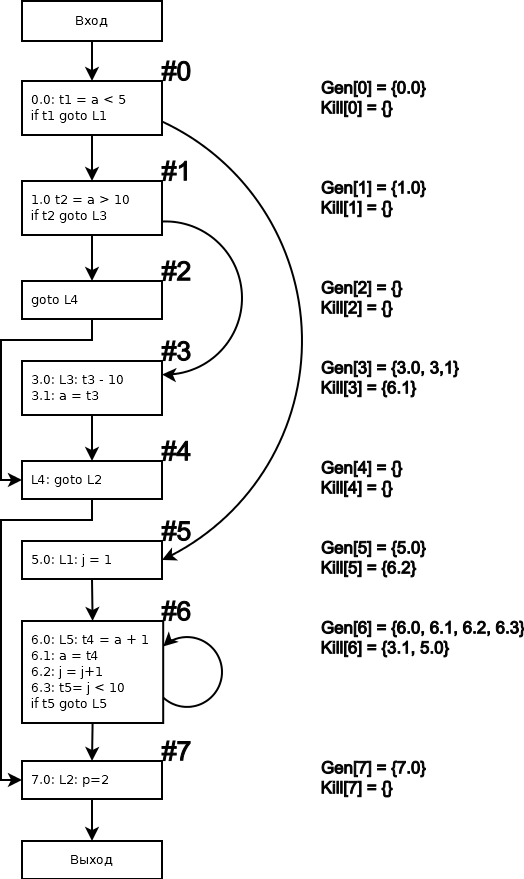

## Вывод
Используя метод, описанные выше, мы смогли выполнить ускорение итерационного алгоритма для задачи о достигающих определениях засчет перенумерации базовых блоков
# Заключение

В ходе работы был создан оптимизирующий компилятор, тестовая система и графический интерфейс. Во время выполнения задания были изучены основные принципы и подходы к разработке оптимизирующих компиляторов, а также были рассмотрены современные инструменты построения компиляторов. Разработчиками были подготовлены тесты и документация к каждой из задач. 
